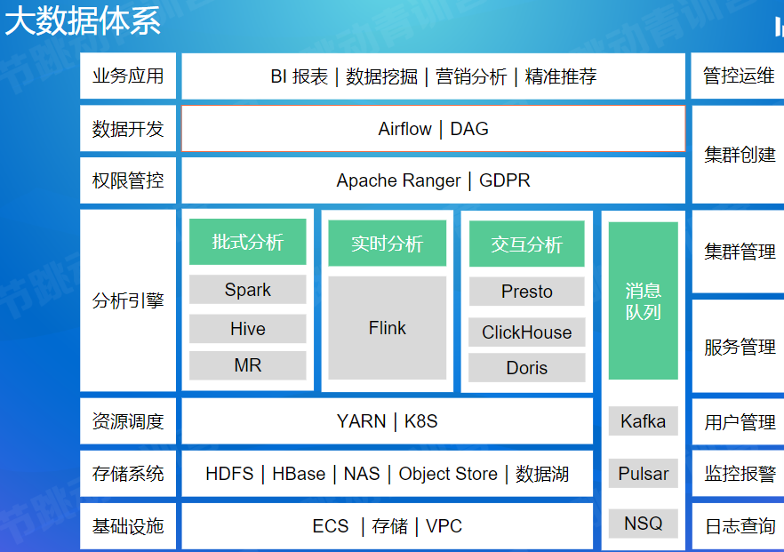
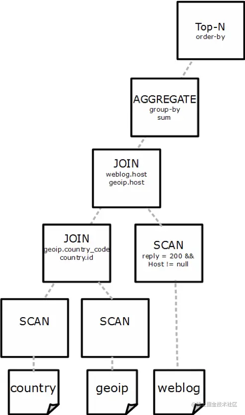
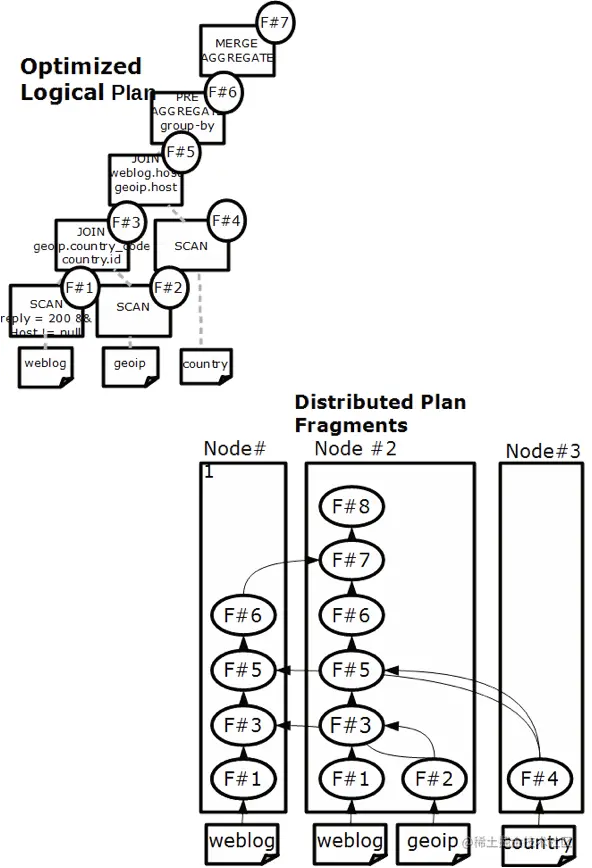

1. SQL 的一生
   1. 
   2. Parser
      1. 把文本变成抽象语法树结构（AST）
      2. 涉及词法分析阶段（拆分字符串，提取关键字，字符串，数值等）和语法分析阶段（把词条按照定义的语法规则组装成抽象语法树结构）
      3. 和编译原理课程里的“前端”知识相关
   3. Analyzer
      1. 访问库/表元信息并绑定
      2. 判断 SQL 是否合理，比如数据库，表和列名是否存在，列的数据类型是否正确
      3. 将 AST 转换成逻辑计划树（在某些系统中这个工作由一个 Converter 完成）

1. 逻辑计划树
   1. 
   2. 所谓逻辑计划树，可以理解为**逻辑地**描述一个 SQL 如何一步步地执行查询和计算，最终得到执行结果的一个分步骤地计划。树中每个节点是是一个算子，定义了对数据集合的计算操作（过滤，排序，聚合，连接），边代表了数据的流向，从孩子节点流向父节点。之所以称它为逻辑的，是因为算子定义的是逻辑的计算操作，没有指定实际的算法，比如对于逻辑的排序算子，逻辑计划树里没有指定使用快排还是堆排。

1. 查询优化
   1. SQL 是一种声明式语言，用户只描述做什么，没有告诉数据库怎么做
   2. 查询优化的目标是为 SQL 找到一个正确的且执行代价最小的执行计划
   3. 查询优化器是数据库的大脑，最复杂的模块，很多相关问题都是 NP 的
   4. 一般 SQL 越复杂，Join 的表越多，数据量越大，查询优化的意义就越大，因为不同执行方式的性能差别可能有成百上千倍
      1. 类比 gcc/g++ 编译程序时的编译级别（-O1, -O2, -O3），经过编译优化的程序运行效率更高

1. 物理执行计划
   1. 
   2. 优化器的输出是一个分布式的物理执行计划。
   3. 分布式物理执行计划的目标是在单机 Plan 的基础上最小化数据移动和最大化本地 Scan，生成 PlanFragment 树。
   4. 一个 PlanFragment 封装了在一台机器上对数据集的操作逻辑。每个 PlanFragment 可以在每个 executor 节点生成 1 个或多个执行实例，不同执行实例处理不同的数据集，通过并发来提升查询性能。
   5. Plan 分布式化的方法是增加 shuffle 算子，执行计划树会以 shuffle 算子为边界拆分为PlanFragment。

1. Executor
   1. Executor 按照物理执行计划扫描和处理数据，充分利用机器资源（CPU 流水线，乱序执行，cache，SIMD）