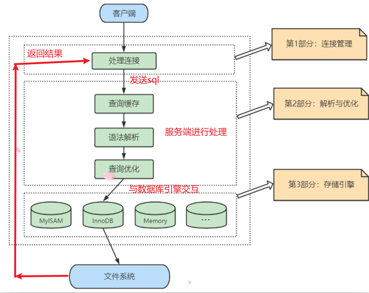
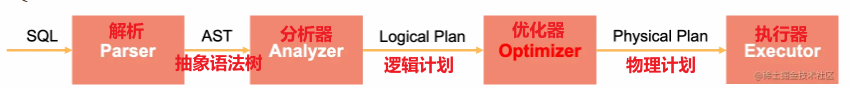
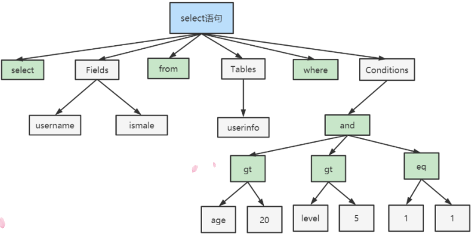
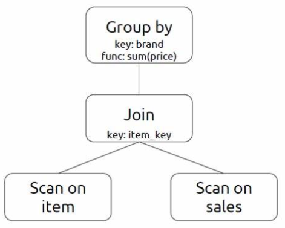

# SQL逻辑框架和sql执行流程

本文阐述两个问题：数据库处理客户端请求的流程是什么样的，sql在服务器中又是怎么运行的。以下内容均为本人理解，如有错误的地方，麻烦您指出。

## 逻辑框架

客户端进程通过 **连接** 向服务器进程发送一段文本( **SQL** 语句)，服务器进程处理后在向客户端发送一段文本(sql返回的**结果**)。

逻辑框架如下：



可以看出客户端通过**连接**向数据库服务器发送SQL语句，然后经过服务器**处理**将客户端请求的结果**返回**，为了容易理解可以将这个过程简单的看成 1.请求 -> 2. 转换 -> 3.导出 三部分，其中 `转换` 这一步骤就是我们接下来要说的`SQL的执行流程`。

## SQL 的执行流程

服务器会`解析查询`并创建相应的内部`解析树`，并对其完成相应的`优化` :
SQL -> **解析** -> `抽象语法树` -> **分析器** -> `生成逻辑计划` -> **优化器** -> `物理计划` -> **执行器**



### Parser：解析器

   - 在解析器中对SQL进行**词法分析**（拆分字符串，提取关键字，字符串，数值等）和**语法分析**（把词条按照定义的语法规则组装成抽象语法树结构）；
   - 把文本变成抽象语法树结构（AST）；
   - 

### Analyzer：分析器

- 访问库/表元信息并绑定；

- 判断 SQL 是否合理，比如数据库，表和列名是否存在，列的数据类型是否正确；

- 将 AST 转换成逻辑计划树（在某些系统中这个工作由一个 Converter 完成）

- 

  所谓逻辑计划树，可以理解为**逻辑地**描述一个 SQL 如何一步步地执行查询和计算，最终得到执行结果的一个分步骤地计划。树中每个节点是是一个算子，定义了对数据集合的计算操作（过滤，排序，聚合，连接），边代表了数据的流向，从孩子节点流向父节点。之所以称它为逻辑的，是因为算子定义的是逻辑的计算操作，没有指定实际的算法，比如对于逻辑的排序算子，逻辑计划树里没有指定使用快排还是堆排。

### Optimizer：优化器

一条查询可以有很多种执行方式，最后都返回相同的结果。在优化器中会确定 SQL 语句的执行路径来找到其中代价最小的执行计划。

```
比如：
	1.表中有多个索引，到底走哪个索引最合适；
	2.有多个表join，到底哪两个表先连接比较合适；
	...
```

在查询优化器中，可以分为 `逻辑查询` 优化阶段和 `物理查询` 优化阶段。

```
逻辑查询:
	通过改变SQL语句的内容来使得SQL查询更高效,通常采用的方式是对SQL语句进行等价变换，对查询进行重写。
	
物理查询:
	基于关系代数进行的查询重写。
```

具体手段包括：

- 列裁剪(指定列；
- 谓词下推(where在表扫描后就执行；
- 传递闭包(join表的条件传递；
- Runtime Filter

查询优化器分类：

- Top-down Optimizer:从目标输出开始，由上向下遍历计划树，找到完整最优执行计划。
- Bottom-up Optimizer:从零开始，由下向上下遍历计划树，找到完整最优执行计划。
- RBO：关系代数，一般由经验归纳得到。
- CBO：使用模型估算执行计划的代价，选择代价最小的执行计划（动态规划）。	

### Executor：执行器

按照物理执行计划扫描和处理数据，充分利用机器资源（CPU 流水线，乱序执行，cache，SIMD）