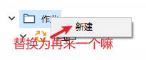
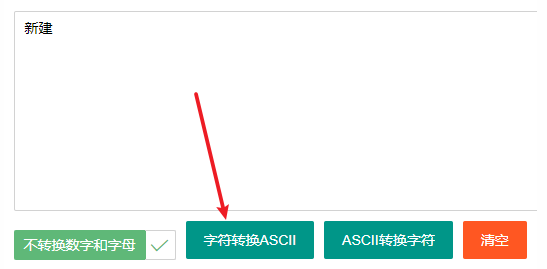
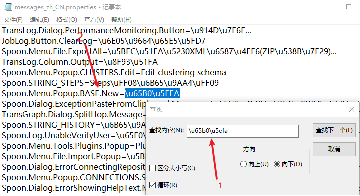
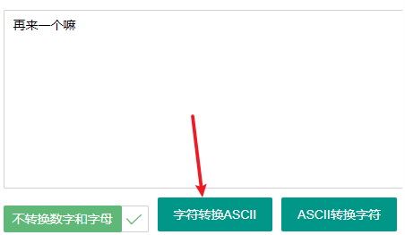
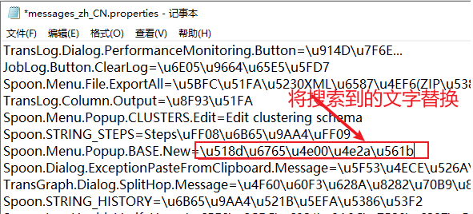
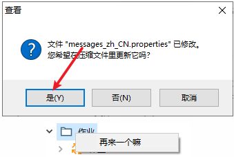

# kettle使用(1)-更换界面logo和文字

kettle主要用于ETL，因为操作简单、门槛低被很多企业使用，今天来说一下不修改源码如何更改kettle的logo和其中的文字(包括标题)。

本文中 `kettle安装目录` 指代为 `%kettle%` 。

**在 `%kettle%\data-integration\lib\` 中找到 `kettle-ui-swt-9.3.0.0-428.jar` ，使用压缩软件查看。**

## 修改图标

替换：自己的图标名称与替换的**名称和扩展名**相同。

- 更改logo图标：在`ui\images\` 找到 `spoon.png`和 `spoon.ico` ，将自己的图标按照源文件的像素大小替换(为了更加契合)即可。
- 更改tab的图标：在`ui\images\` 找到 `kettle_logo_small.png` 和 `kettle_logo_small.svg` ，注意 `svg` 格式的文件需要进行格式转换才能得到，在网页中搜索 `svg格式转换` 转换后替换文件即可。
- 启动界面图片：`\ui\images\kettle_splash.png`
- 启动界面版本信息：`\ui\org\pentaho\di\ui\core\dialog\messages\messages_en_US.properties`中的`SplashDialog.Version`
  启动界面license：`\ui\org\pentaho\di\ui\core\dialog\license\license.txt`

理论上来说，你在这里找到的图标都可以进行修改替换成自己想要的图片。

## 修改文字

kettle界面中的文字在文件中使用`字节码`保存的，所以我们在其中搜索和修改都是用`字节码`格式来进行的，在网页搜索`字节码在线转换`即可。

编辑 `org\pentaho\di\ui\spoon\messages` 下`messages_zh_CN.properties` ，搜索你要替换的文字，将文字替换即可。标题搜索`Spoon.Application.Name` 替换内容即可。

举个例子，现在我将 `右键转换弹出的新建` 两字替换为 `再来一个嘛` ：

1. 将 `新建` 转换为`ASCII`格式 `\u65b0\u5efa`:

   

2. 在`messages_zh_CN.properties` 中搜索转换后的文字：

   

   注意可能搜索结果不唯一，选择查找结果只有你搜索的内容。

3. 将 `再来一个嘛` 转换为ASCII 格式 `\u518d\u6765\u4e00\u4e2a\u561b` 后替换：

   

   

4. 保存退出查看效果：

   

理论上来说，你在这里找到的文字都可以进行修改替换成自己想要的文字；理论上来说，文字相关的文件都在messages文件夹下。

更多示例：[kettle示例 – Kettle中文网](http://www.kettle.org.cn/category/demo)