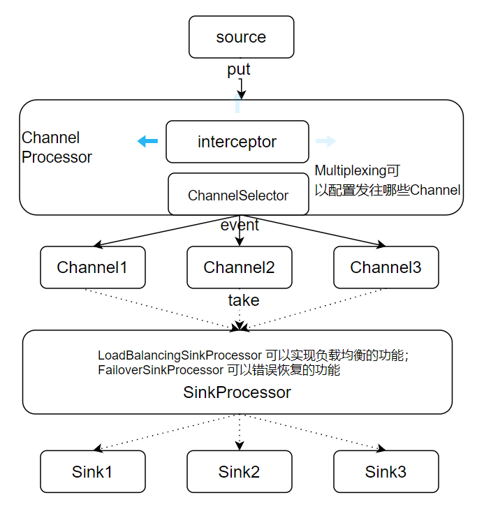
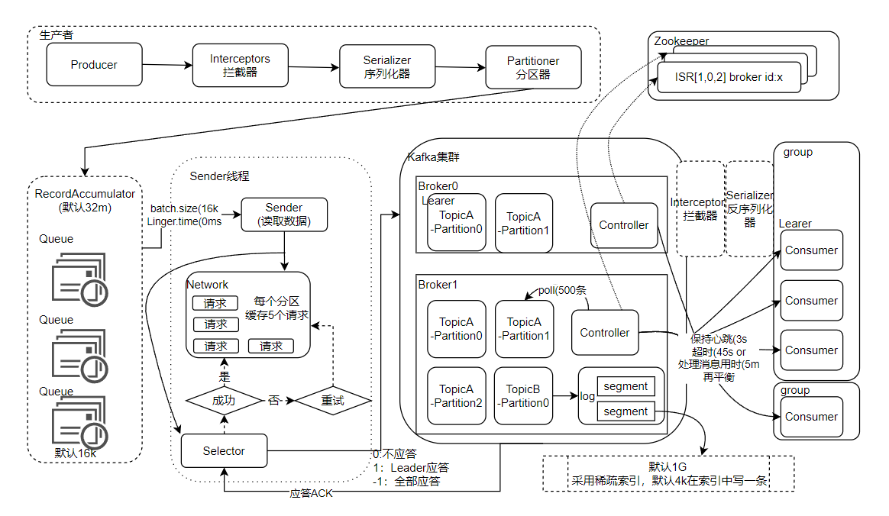
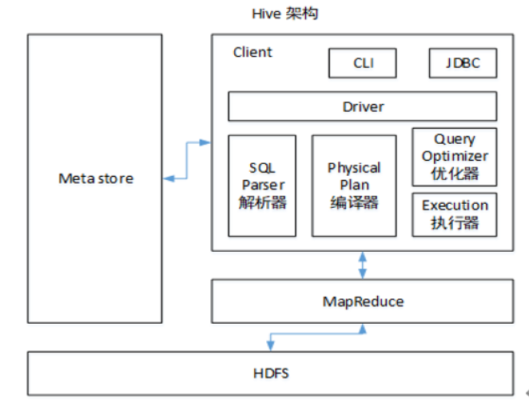
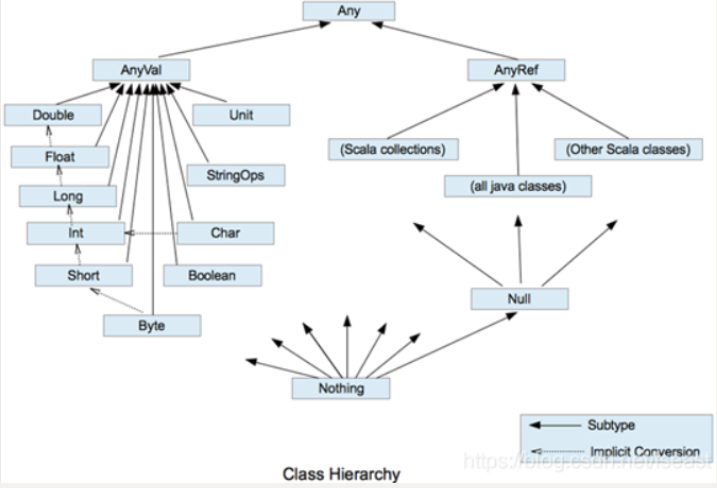
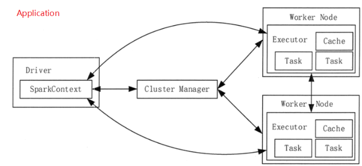
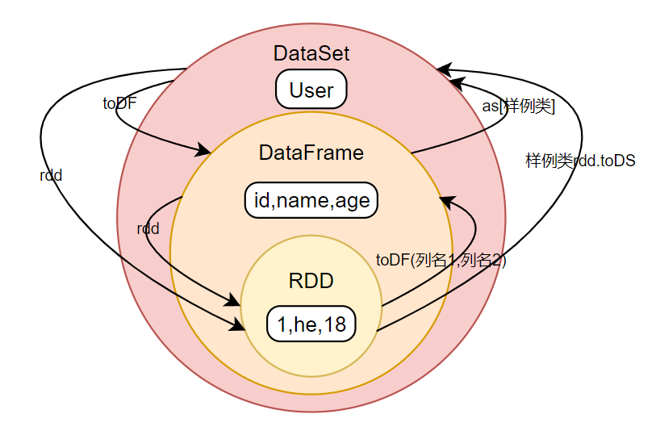
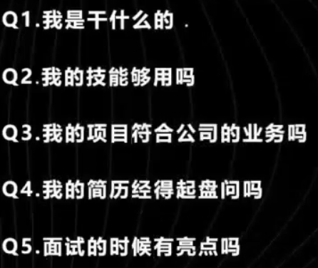

[TOC]


### linux常用命令

| 序号 | 命令                          | 命令解释                               |
| ---- | ----------------------------- | -------------------------------------- |
| 1    | top / free                    | 查看内存                               |
| 2    | df -h                         | 查看磁盘存储情况                       |
| 3    | iotop                         | 查看磁盘IO读写(yum install iotop安装） |
| 4    | iotop -o                      | 直接查看比较高的磁盘读写程序           |
| 5    | netstat -tunlp \| grep 端口号 | 查看端口占用情况                       |
| 6    | uptime                        | 查看报告系统运行时长及平均负载         |
| 7    | ps -ef                        | 查看进程                               |

#### Shell常用工具

awk{print $1}；sed；cut；sort；xargs -n

单引号不取变量值，反引号执行命令，双引号嵌套单引号取变量值

------

### Hadoop

|                    | hadoop2.x | Hadoop3.x |
| ------------------ | --------- | --------- |
| 访问HDFS端口       | 50070     | 9870      |
| 访问MR执行情况端口 | 8088      | 8088      |
| 历史服务器         | 19888     | 19888     |
| 客户端访问集群端口 | 9000      | 8020      |

#### HDFS读流程

1. 客户端向NameNode发送请求
2. NN返回目标文件的元数据
3. 客户端向DataNode请求读取数据
4. 读到数据后关闭FSDataInputStream

#### HDFS写流程

1. 客户端向NN请求上传
2. NN判断是否可以上传(权限 / 文件if exists)并响应
3. Cli请求上传第一个块，请返回DN
4. NN根据节点选择，返回DN
5. Cli与对应DN建立传输通道
6. 应答成功后传输数据
7. 完成后关闭FSDataOutputStream

#### HDFS小文件处理

影响：
​	1、存储：一个文件占用一个文件块,文件元数据存储在nn内会影响NameNode的寿命
​	2、计算：一个小文件启用一个MapTask,默认1G

解决：
​	1、采用har归档方式
​	2、文件切片，采用CombineTextInputFormat把多个文件合并到一起统一切片
​	3、开启JVM重用

#### NameNode

- 内存是动态分配的，最小1G,每增加100万个block，增加1G内存
- NN会维护一个心跳以确定DN的存在

#### 纠删码原理

每3个数据单元，生成2个校验单元，这5个单元中，只要有任意的3个单元存在(不管是数据单元还是校验单元，只要总数=3)，就可以得到原始数据。

#### MapReduce运行流程

Cli提交job ->Yarn RM -> TextInputFormat -> kv -> Mapper -> 环形缓冲区 -> Partitioner -> 排序 -> Merge归并 ->Reducer ->Merge 

#### shuffle及优化

1. map后，reduce前(排序->分区内有序，归约->combiner，分组)
2. 不影响业务逻辑下采用Combiner预聚合
3. 减少溢写次数，修改环形缓冲区大小
4. 自定义分区，减少数据倾斜
5. 采用压缩，减少IO

#### Yarn

- Application:Mr申请 -> RM返回路径 -> Mr提交资源 -> 运行AM -> NodeManager ->  运行 -> 注销YarnChild 
- Yarn的调度器:FIFO / 容量(资源紧张) / 公平(并发度)

#### 数据倾斜

1. 提前在map将key聚合combine,减少传输
2. 两阶段聚合(局部聚合+整体聚合：如果key分布在不同mapper:二次mr，第一次将key随机散列到不同reducer进行处理达到负载均衡目的。第二次再根据去掉key的随机前缀，按原key进行reduce处理。)
3. 实现自定义分区
4. 增加Reducer，提升并行度

------

### Zookeeper

#### 常用命令

ls / get / creatae / delete

#### CAP法则

一个分布式系统不可能同时满足以下三种：

- 一致性(C Consistency)：数据在多个副本之间能够保持数据一致的特性；
- 可用性 (A Available)：系统提供的服务一直处于可用的状态；
- 分区容错性(P Partition Tolerance)：分布式系统在遇到任何网络分区故障时，仍然需要能够保证对外提供满足一致性和可用性的服务

ZooKeeper保证的CP

1. 不能保证每次服务请求的可用性(极端情况消费者程序要重新请求)
2. 进行Leader选举时集群不可用

#### 选举机制

半数机制：2n+1，安装奇数台

10 / 20 / 100台服务器--3 / 5 / 11台安装zookeeper

##### 第一次选举

1. 服务器启动发起选举
2. 首先给自己来一票
3. 如果服务器状态为LOOKING则交换选票，否则保持
4. myid小的改票为下一台
5. 如果下一台服务器的票数超过半数，立即当选Leader
6. 后来服务器发动选举，如果有Leader则服从

##### 非第一次选举

服务器无法与Leader保持连接：

- 服务器试图选举，被告知存在Leader，需要建立连接并状态同步

集群中不存在Leader：

- EPOCH(任期代号)>事务id大>服务器id

#### Follower和Leader状态同步

当Follower或Leader挂掉会进行状态同步,L和F通过心跳监测机制来感知彼此的情况。

同步策略：差异化同步(DIFF)、回滚同步(TRUNC)、全量同步(SNAP)

- 当Follower挂掉：事务id小于Leader的事务id则差异化，大于则回滚
- 当Leader挂掉：以新Leader为主，保证让 followers 同步已提交的提议，丢弃未提交的提议

------

### Flume

海量日志采集、聚合和传输的系统



#### 组成

1.event:基本传输单元-> header|body

2.taildir source:

- 断点续传、多目录；
- 不支持递归文件夹读取文件--需要自定义。

3.channel:

- file channel :数据存储磁盘，可靠性高传输效率低；(可以配置dataDirs指向多个路径，增大吞吐量)--安全
- Memory channel: 数据存储于内存，速度快可靠性差；--速度
- Kafka channel：数据存储在Kafka，基于磁盘，可靠性高速度快，省去了sink阶段；--面向Kafka

4.HDFS sink:拉取event，送到hdfs

5.Agent：source、channel、sink组成

#### 拦截器

ETL拦截器、时间戳拦截器、自定义拦截器(注意实现Interceptor.Builder)

拦截器可以不用，但是需要在下一级进行处理。

#### Channel选择器

- Replicating：默认选择器(复制)
- Multiplexing：选择性发往指定通道(多路复用)

#### Sink

- LoadBalancingSinkProcessor 可以实现负载均衡的功能；
- FailoverSinkProcessor 可以错误恢复的功能

#### Flume监控器

采用Ganglia，如果监控到尝试提交的次数远远大于最终成功的次数，说明Flume运行较差，可以增加内存。

#### Flume的事务机制

- 使用两个独立的事务分别负责从Source 到 Channel(put)，以及从 Channel 到 Sink(take) 的事件传递;
- 数据可能重复(sink发出数据没响应会继续发送)、但不会丢失(事务机制，Memory Channel可能丢)；

------

### Kafka

#### 架构

生产者、Broker、消费者、Zookeeper(Broker id、ids等)



#### 参数配置

- 机器数量=2 *(峰值生产速度 * 副本数  /  100)+ 1
- 副本数：2 / 3 -> 提高可靠增加IO
- 日志保存(7天 ，建议3天
- 硬盘大小=数据量 * 副本 * 天数  /  70%
- 分区数=期望吞吐量 / min(producer,consumer吞吐量)
- Topic数量=日志类型数量
- 内存：默认1g

#### 生产者

面向一个topic

- 发送方式：同步、异步、带回调函数异步

- 分区分配策略：producer可以指定分区，将数据存储在（key的hash值 % 分区数）号分区中

- 提高吞吐：批次大小(batch.size:16k->32k) / 等待时间(linger.ms:0->5-100ms) / 压缩(compression.type) / 缓冲区大小(32m->64m)

- 数据可靠：

  Ack:

  1. Ack=0:生产者发送消息增加offset，继续生产；数据可能丢失
  2. Ack=1:Leader应答增加offset；
  3. Ack=-1:Leader和ISR队列所有Follwer应答增加offset；数据可能重复

  幂等性(enable.idempotence) :生产者发送的消息Broker端只持久化一条（单分区单会话）

  精确一次=  幂等性 +  至少一次( ( ack=-1 +  分区副本数>=2 + ISR 最小副本数量>=2) )+无限重试

- 数据重复：开启事务（ 必须指定transactional.id）或在下一级（分组、开窗）

#### Broker

与zookeeper交互保证集群运行，版本0.9之后offset保存在topic中。

##### 服役新节点

1. 创建一个要均衡的主题
2. 生成一个负载均衡的计划
3. 创建副本存储计划
4. 执行副本存储计划
5. 验证副本存储计划

##### 退役旧节点

- 生成执行计划，同服役

Flower挂：踢出isr,其他不影响，上线后读取log里面副本中最小的offset（HW)，直到>=HW

Leader挂：从isr选新，其余follower从新Leader同步

##### offset提交

自动（可能重复消费） / 手动（可能漏消费）；

为避免可以将消费过程与提交offset过程做原子绑定，要求下游支持事务。

#### 消费者

- 拉取数据

- Consumer Group （CG ）：消费者组，由多个 consumer组成,面向一个topic。

  1.消费者组内每个消费者负责消费不同分区的数据，一个分区只能由一个组内消费者消费，一个消费者可以消费多个分区（组内只有自己消费此分区）；

  2.消费者组之间互不影响。所有的消费者都属于某个消费者组，即消费者组是逻辑上的一个订阅者

- 再平衡及Range(将TopicAndPartition按照hashCode排序，轮询发给每个消费线程)

- 保证数据有序：开启幂等性->缓存数量小于5个，会在服务端重新排序 ;关闭幂等性->缓存数量设为1（因幂等性，所以单分区有序）

- 副本同步队列：zookeeper会维持一个isr队列，Leader挂掉会顺延isr中下一个服务，当心跳超过45s或者处理消息超过5分钟就会认为服务不可用并剔除出isr。

- 数据可靠：手动提交offset

- 可以按照时间消费数据：需要将offset转换为时间戳KafkaUtil.fetchOffsetsWithTimestamp

#### 数据积压

消费能力不足：增加topic分区数，提升消费者数量，消费者数 = 分区数；

下游处理不及时（生产速度>拉取速度）：提高每批次拉取的数量；

#### 如何实现高效读写

1. 本身是分布式集群，同时采用分区技术，并发度高；
2. 顺序写磁盘：生产者生产数据是追加到log文件的末端；
3. 读数据采用稀疏索引，可以快速定位
4. 零复制技术

#### 单条日志大小

如果遇到一条消息大于1M,默认情况下可能procuder无法推送或consumer无法消费；

需要配置server.properties中的replica.fetch.max.bytes（可复制的消息的最大字节数）和message.max.bytes（kafka 会接收单个消息size的最大限制）。需注意接收必须小于等于复制

#### 过期数据清除

log.cleanup.policy=delete（删除） /  compact（压缩）

#### 数据顺序

单分区内有序；多分区，分区与分区间无序；

生产者可以指定key以将数据发送到同一个分区；

------

### Hive

可以将结构化数据映射成一张数据表,并提供类SQL的查询功能，本质是将SQL语句转化成MapReduce程序；

Hive元数据默认存储在derby数据库，不支持多客户端访问，所以将元数据存储在MySQL，支持多客户端访问。



#### 与数据库比较

- 类似的查询语句；
- 数据存储在HDFS；
- 数据更新不建议改写；
- 执行延迟较高，需要将hql转换为Map Reduce跑job
- 数据规模很大；

#### 建表

```sql
CREATE [EXTERNAL] TABLE [IF NOT EXISTS] table_name / *创建[外部]表* / 
[(col_name data_type [COMMENT col_comment], ...)]
[COMMENT table_comment]
[PARTITIONED BY (col_name data_type [COMMENT col_comment], ...)] / *分区* / 
[CLUSTERED BY (col_name, col_name, ...) / *分桶表* / 
[SORTED BY (col_name [ASC|DESC], ...)] INTO num_buckets BUCKETS] / *桶内排序* / 
[ROW FORMAT row_format] / *格式化表* / 
[STORED AS file_format] / *指定存储文件类型* / 
[LOCATION hdfs_path] / *指定表在HDFS的路径* / 
[TBLPROPERTIES (property_name=property_value, ...)] / ** / 
[AS select_statement] / *根据查询结果创建表* / 
```

```sql
 / *格式化表种类* / 
DELIMITED 
[FIELDS TERMINATED BY char]  / *指定分隔符* / 
[COLLECTION ITEMS TERMINATED BY char]
[MAP KEYS TERMINATED BY char]
[LINES TERMINATED BY char]
|
SERDE serde_name
[WITH SERDEPROPERTIES (property_name=property_value, property_name=property_value, ...)]
```

#### 内部(管理)表和外部表external

元数据：指向原始数据的路径；原始数据：数据的存储位置

|      | 内部表            | 外部表           |
| ---- | ----------------- | ---------------- |
| 创建 | 移动原始数据      | 路径记录到元数据 |
| 删除 | 元 / 原始数据都删 | 只删除元数据     |

#### 四个By

- Order By：全局排序，只有一个Reducer；
- Sort By：分区内有序；
- Distrbute By：根据指定字段进行分区，将数据划分到不同reduce中，结合sort by使用,distrbute by 在前（例如按学院编号分区，学生学号排序）；
- Cluster By：当Distribute by和Sorts by字段相同时，可以使用Cluster by方式，只能升序；

#### 常用函数

- nvl(val,def_val):返回非空值否则null；
- coalesce(v1,v2,...):返回第一个非空值否则null；
- CASE WHEN THEN ELSE END ：多分支；
- grouping_set:多维分析；
- cast(col as type):格式转换;

##### 日期函数

- unix_timestamp:返回当前或指定时间的时间戳；
- year / month / day / hour / minute / second / week:年月日时分秒周；
- datediff：两个日期相差的天数；
- date_add：日期加减天数；
- add_months：日期加减月；
- next_day(date,week): 下周几的日期；
- last_day:当月最后一天；
- date_format(): 格式化日期；

##### 取整函数

- round： 四舍五入；
- ceil：  向上取整；
- floor： 向下取整；
- rand:随机数；

##### 字符串函数

- upper： 转大写；
- lower： 转小写；
- length： 长度；
- trim：  前后去空格；
- reverse：反转；
- concat:字符串连接；
- concat_ws:带分隔符字符串连接（只接受string or array<string>）；
- substr:字符串截取；
- get_json_object(string json_string, string path)：解析json函数；
- regexp_replace：使用正则表达式匹配目标字符串，匹配成功后替换；

##### 集合操作

- size： 集合中元素的个数；
- spilt:按照指定字符切割返回字符串数组；
- map_keys / map_values： 返回map中的key / value；
- array_contains: 判断array中是否包含某个元素；
- collect_set(col) / collect_list() : 返回去重 / 不去重后的汇总array (接受基本数据类型)；
- explode：将array或map炸裂成多行（如果想要与原字段关联需要用到lateral view侧表）；
- LATERAL VIEW udtf(expression) tableAlias AS columnAlias:udtf函数与原字段关联所需，在from表后；

#### 更多

- [更多](https://blog.csdn.net/hello_java_lcl/article/details/106690120)
- [官网](https://cwiki.apache.org/confluence/display/Hive//LanguageManual)

#### 窗口函数

##### rank排名函数

- RANK() 排序相同时会重复，总数不会变(113)；
- DENSE_RANK() 排序相同时会重复，总数会减少(112)；
- ROW_NUMBER() 会根据顺序计算(123)；

##### over()窗口大小

- current row:当前行；
- n preceding / following：往前 / 后几行；
- unbounded:起点，unbounded preceding：从前面起点，unbounded following：到后面终点；
- LAG / LEAD(col,n):往前 / 后第n行数据；
- ntile(n):将数据分成n块；

##### 例

rank() over(partition by col1,col2 order by col1 desc,col3 asc rows between ... and ...)

#### 自定义函数

- UDF：一进一出；
- UDAF：聚集函数，多进一出（max,rank）；
- UDTF： 一进多出;
  1. udtf -> 重写3个方法：a. initialize（自定义输出的列名和类型）b. process（将结果返回forward(result)）c. close ;
  2. 上传jar包到hive的classpath下
  3. 创建函数
  4. 使用函数

#### DML数据操作

##### 导入

- load data [local] inpath '数据的 path' [overwrite] into table tab_name [partition (partcol1=val1,…)]; ->装载数据
- insert [overwrite|into] table tab_name partition(partcol1=val1) <查询语句>；->通过查询插入数据
- create table if not exists tab_name as select；->建表时加载数据
- location 'Path' ;->建表时指定数据路径
- import table tab_name from 'Path'; ->export导出后，Import导入

##### 导出

- insert overwrite [local] directory 'Path' <查询语句> ；->insert导出
- Hadoop中原始数据导出到本地
- hive -f / -e 执行语句或者脚本 > file ；-> Linux追加到文件
- export table tab_name to 'Path'; ->两个 Hadoop 平台集群之间 Hive 表迁移
- Sqoop 导出

#### hive优化

##### explain查看执行计划

EXPLAIN [EXTENDED...] query-sql 查看sql[详细]执行计划

show partitions|functions name 查看分区表|函数情况

##### 建表（分区 / 桶,存储格式,压缩）

1. 分区表

   对应HDFS上的独立文件夹，分区就是分目录；

   分区字段不能是表中存在的数据，可以看作时表的伪列；

   查询时通过where查询指定分区，效率无敌！；

   1. 创建

      建表时加入partitioned by (col string)；

      分区表加载数据时，必须指定分区；

   2. 二级分区

      分区字段增加一个

   3. 动态分区

      对分区表insert数据时，数据库会根据分区字段将数据插入对应分区。

      配置：开启动态分区功能、设置为非严格模式、在每个 / 所有MR节点可以创建多少动态分区、MR Job中，最大可以创建多少个HDFS文件。例：

      ```sql
      insert into table tab_name 
      partition(loc) 
      select col1, loc from dept;
      ```

2. 分桶表

   分区针对的是数据的存储路径，分桶针对的是数据文件。

   1. 创建

      建表时加入 clustered by(id) into 4 buckets；

      reduce个数设置-1或大于等于分桶数，

   2. 抽样查询

      `TABLESAMPLE(BUCKET x OUT OF y)` ：x<=y

3. 文件格式

   1. 列式存储和行式存储

      行存储更适合查询一整行数据的情况；

      列存储是个查询只需要少数字段情况，由于每个字段数据类型相同，所以更适合压缩；

   2. TextFile格式

      默认格式，数据不做压缩耗费资源；行式存储

   3. Orc格式

      列式存储

   4. Parquet格式

      以二进制方式存储，文件包括数据和元数据；列式存储

4. 压缩格式

   | 压缩格式 | 切片 |
   | -------- | ---- |
   | DEFLATE  | 否   |
   | Gzip     | 否   |
   | bzip2    | 是   |
   | LZO      | 是   |
   | Snappy   | 否   |

##### 语法优化

- 多重插入

  如果导入数据时遇到多条sql模式相同并且从同一个表扫描，可以使用多重插入，一次读取，多次插入。

- 行列过滤

  行处理：使用外连接时将副表的过滤条件写到on(副表的查询)中，否则会先全表关联，在进行过滤。

  列处理:只拿需要的列，少用select *，只读取需要的分区。

- in / exists语句

  在sql中多用exists，在hive中用left semi join 实现会更好。

- 小表、大表join(MapJOIN)

  默认开启；

  MAPJION会把小表全部读入内存中，在map阶段直接拿另外一个表的数据和内存中表数据做匹配，由于在map是进行了join操作，省去了reduce运行的效率也会高很多

- 大表、大表Join

  a.空key过滤：如果join条件中有key为异常数据，则条件过滤；

  b.空key转换：可以表中 key 为空的字段赋一个随机的值

  c.SMB：分桶表join

- 笛卡尔积

  join不加on条件或者无效，会使用1个reduce完成笛卡尔积，设置为严格模式，不允许出现笛卡尔积

- Count(distinct) 

  此操作需要一个reduce task完成，可以用group by + count 替换

- union(去重) union all (不去重)

##### job优化

1. map优化

   MapTask数=文件数，尽量减少小文件；

   a. 小文件进行合并：在Map前合并小文件(CombineHiveInputFormat)、在输出合并小文件（merge）；

   b. 复杂文件增加Map数：当input的文件都很大，任务逻辑复杂，可以增加Map数(使每个map处理的数据量减少，减小max可以增加map数，增大max可以减少map数)；

   c. 开启map端聚合combiner（不影响最终业务逻辑）；

2. reduce优化

   一个reduce会生成一个文件，启动和初始化也会消耗时间；

   处理大数据量利用合适的Reduce数；使单个Reduce任务处理数据量大小要合适；

3. 整体优化

   a.Fetch抓取：在某些情况不会使用MR计算；

   b.小数据集使用本地模式( set hive.exec.mode.local.auto=true;)；

   c.数据量大使用并行执行(set hive.exec.parallel=true;)；

   d.严格模式(hive.strict.checks)：分区表使用分区过滤、order by 指定limit、笛卡尔积

   e.小文件过多JVM重用

   f.压缩

#### 数据倾斜

少数任务相比下执行很慢。

##### 单表

1. Group by -> 进行负载均衡(set hive.groupby.skewindata = true;)、map端进行聚合(hive.map.aggr)
2. 多个相同key导致 ->增加Reduce数量、自定义分区器、加随机数或过滤

##### Join数据倾斜优化

1. MapJoin,将小表读入内存；
2. 使用参数：如果join的键对应的记录数超过(hive.skewjoin.key)则进行分拆

#### hive分隔符和空值

在建表时通过`FIELDS TERMINATED BY` 指定分割符；

null实际在HDFS中默认存储为'\N'；可以自定义底层用什么表示null；判断使用a is null 或者 a='\\N'；处理使用nvl,case,coalcsce；

#### 引擎对比

Mr引擎：多job串联，基于磁盘，落盘的地方比较多;

Spark引擎：Shuffle过程中落盘,兼顾了可靠性和效率;

Tez引擎：完全基于内存，将多个有依赖的作业转换为一个作业，只需写一次HDFS。

------

### Sqoop

#### sqoop参数

```sqoop
/opt/module/sqoop/bin/sqoop import \
--connect \
--username \
--password \
--target-dir \
--delete-target-dir \
--num-mappers \
--fields-terminated-by   \
--query   "$2" ' and $CONDITIONS;
```

#### 导入导出null存储一致性

hive中null底层表示为'\N' ，mysql中表示为Null，为保持导入 / 出一致：

导入->--null-string和--null-non-string

导出->--input-null-string和--input-null-non-string

#### 数据导出一致性

指导出部分成功数据导致数据出错，使用--staging-table 充当用于暂存导出数据的辅助表以解决

#### 导出Parquet

如果是列式存储则不能直接导出。

1. 创建临时表保存parquet
2. 将临时表导出

------

### HBase


------

### Scala

- 变量和数据类型以及隐式转换（var 变量val 常量）
- 流程控制（if-else、for、while）以及模式匹配（switch case  样例类）
- 函数式编程(高阶函数、匿名函数、函数柯里化、函数参数以及函数至简原则、闭包)
- 面向对象(特质->第一个用extends后面用with；apply)
- 集合（List，Array，Map及函数）
- 异常及泛型



------

### Spark

解决海量数据的分析计算；先申请资源，在进行计算；

#### 运行框架



1. 构建Application环境，申请资源；
2. 启动Executor,与Cluster Manager维持心跳；
3. Spark Context构建DAG，将 DAG 图分解成多个 Stage,任务调度器将task分发；
4. Executor执行任务；

##### Driver

- 将用户程序转化为作业（job）
- 在 Executor 之间调度任务(task)
- 跟踪Executor 的执行情况
- 通过UI 展示查询运行情况
- 算子以外的代码都是在Driver 端执行

##### Executor

- 运行在工作节点（Worker）中的一个JVM 进程，是整个集群中的专门用于计算的节点；
- RDD 直接缓存 Executor 进程内；
- 算子里面的代码都是在Executor 端执行

##### Master & Worker

独立部署环境中

- Master是一个进程，负责资源的调度和分配，并进行集群的监控等；
- Worker 运行在集群中的一台服务器上，由 Master 分配资源对数据进行并行的处理和计算；

##### ApplicationMaster

用于向资源调度器申请Container容器，资源与计算的解耦；

#### Spark运行模式

- Local：运行在一台机器上。 测试用。
- Standalone：是Spark自身的一个调度系统。 
- Yarn：采用Hadoop的资源调度器

#### Spark常用端口号

- 4040:spark-shell 任务端口
- 7077：内部通讯端口
- 8080：任务执行的端口
- 18080：历史服务器

#### RDD五大属性

rdd主要是将逻辑封装，生成task发送到executor执行计算

1. 分区列表

   rdd是被分区的，每个分区都会被一个计算任务(Task)处理，用于执行任务时并行计算；

2. 每个分区都有计算函数

   使用分区函数对每个分区计算；

3. 基于其他rdd的列表

   rdd之间的依赖关系(血缘)：宽依赖(有shuffle)和窄依赖(每个上游rdd最多被下游的一个分区使用->独生子女)；

4. key-value数据类型的分区器

   当数据为 KV 时，可以通过(Hash分区 / Range分区 / 用户自定义分区)指定分区；

5. 首选位置

   计算数据时，可以根据计算节点的状态选择不同的节点位置进行计算；

#### RDD转换算子

value: map / mapPartitions / mapPartitionsWithIndex / flatMap / glom / groupBy / filter / sample / distinct / coalesce / repartition / sortBy

双value：intersection / union / subtract / zip

key-value: partitionBy / reduceByKey / groupByKey / aggregateByKey / foldByKey / combineByKey / sortByKey / join / leftOuterJoin / cogroup

#### RDD行动算子

reduce / collect / count / first / take / takeOrdered / aggregate / fold / countByKey / foreach / save相关

当spark与数据库操作时，由于数据算子内的操作都是在executor端做的，所以需要有闭包的问题，可以使用foreachPartition代替foreach，在前者中获取数据库连接，那样只需要在一个分区内连接一次了。

#### RDD 序列化

在函数式编程中算子内会用到算子外的数据，形成闭包的效果，由于算子里面的代码都是在Executor端执行的，所以要将数据发送到Executor中，所以需要序列化。

Kryo 序列化框架：

```scala
// 替换默认的序列化机制
.set("spark.serializer","org.apache.spark.serializer.KryoSerializer")
// 注册需要使用 kryo 序列化的自定义类
.registerKryoClasses(Array(classOf[Searcher]))
```

序列化需要继承Serializable 接口

#### RDD 持久化

- cache:将数据存储在磁盘、内存等，不切断血缘依赖；

- checkpoint：将数据存储在HDFS等高可用的文件系统，切断血缘关系；

  ```scala
  rdd.cache() //rdd默MEMORY_ONLY
  df.cache()//dataframe默MEMORY_AND_DISK
  // 设置检查点路径
  sc.setCheckpointDir("./checkpoint1")
  rdd.checkpoint()
  ```

  建议对checkpoint()的RDD 使用Cache 缓存

#### 累加器

将Executor 端变量信息聚合到Driver 端。

##### 系统累加器

1. 声明`sc.longAccumulator("name")`
2. 使用`acc.add()`
3. 取值 `acc.value`

##### 自定义累加器

1. 继承 AccumulatorV2，并设定泛型
2. 重写累加器的抽象方法

#### 广播变量

向所有工作节点发送一个较大的只读值。

1. 声明：`sc.broadcast(较大的对象)`
2. 使用：`broadcast.value`

#### 任务的划分

- Application：初始化一个SparkContext即生成一个Application；
- Job：一个Action算子就会生成一个Job；
- Stage：Stage等于宽依赖的个数加1；
- Task：一个Stage阶段中，最后一个RDD的分区个数就是Task的个数。

#### RDD、DataFrame、DataSet三者的转换



- DataFrame每一行的类型固定为Row，通过解析可以获取各个字段值；
- DataSet每一行的类型是不一定的，通过getAS方法或者模式匹配拿出特定字段；

#### Spark Streaming

##### 参数调整

- auto.offset.reset -> earliest 从最初始偏移量开始消费数据；
- spark.streaming.kafka.maxRatePerPartition 从kafka分区每秒拉取的条数(延迟)；
- spark.streaming.backpressure.enabled 背压机制，根据延迟动态消费Kafka数据；
- spark.streaming.stopGracefullyOnShutdown 在JVM关闭时正常StreamingContext;
- 默认分区数与对接Kafka topic 分区个数一致；
- 一个stage耗时由最慢task决定；

##### Kafka数据源

Receiver：需要一个专门executor接收数据然后发到计算executor中，接收数据的Executor和计算的Executor 速度会有所不同，可能会导致内存溢出；

Direct：使用Kafka的api，Spark Streaming自己就负责追踪消费的offset，并保存在checkpoint中。可以保证数据消费一次且仅消费一次。

##### 无状态/有状态转换

- transform

  将DStream转换为rdd操作；

- UpdateStateByKey

  需要对检查点目录进行配置，会使用检查点来保存状态；

- WindowOperations

  在原来SparkStreaming计算批次上封装，增加窗口时长以及滑动步长：必须为采集周期大小的整数倍；

#### Spark 数据倾斜

- 表现

  部分任务极慢，任务卡在某个阶段不能结束，任务突然失败

- 原因

  数据激增，Key分布不均，建表连接性差；

- 思路

  数据预处理，异常值过滤；

  数据激增可以单独对这部分数据做两次MR先打散在聚合；

  优化代码逻辑，优化sql(每个行动算子都会增加job,每次shuffle都会增加一个阶段)、调参(Hadoop切片、预聚合、合并，hive中MapJoin等)；

- 定位数据倾斜

  1. 通过web UI或者日志查看task运行情况，定位是哪个stage出现问题；
  2. 代码中在spark或sparkSQL中出现shuffle语言，那么就可以分出前后两个stage，定位出现问题的stage，优化代码逻辑。

- 方法

  - hive中ETL处理数据(在hive中预先将key聚合，spark对预处理的hive表操作) ->提升性能但是在hive ETL中还是会倾斜；
  - 过滤掉少数导致倾斜的key(filter/where) -> 适用于倾斜的key少并且对计算本身影响不大的情况;
  - 提高shuffle操作的并行度(在执行shuffle算子的时候传入参数设置spark.sql.shuffle.partitions，代表了并行度，默认200)->适用于相同key数据不多情况；
  - 两阶段聚合（局部聚合+全局聚合）先将key打上随机数前缀后聚合，然后将前缀去掉全局聚合 -> 适用于聚合类的shuffle操作；
  - 将reduce join转为map join(将较小的rdd直接collect拉到内存，然后对其创建广播变量，遍历较大的rdd与变量合并) -> 适用于大表和小表join的情况；
  - 将倾斜key打散加前缀join后union合并（采样倾斜key过滤出作为新rdd并加上n以内的随机前缀,将需要join的另一个rdd也过滤出倾斜key膨胀并加上前缀，之后两个rdd进行join；另外两个正常rdd照常join后union合并得到最终join结果）(将另一个rdd膨胀是为了与倾斜key的随机前缀连接上) -> 少量Key倾斜；
  - 使用随机前缀和扩容RDD进行join（同上但对整个rdd扩容）-> 缓解数据倾斜，对内存资源要求高；

  将多种方案结合：a->b->c->(d/e/f/g)

------

Flink

------

### 基本算法


------

### 手写HQL

#### 用户行为路径

##### 问题描述

统计每次跳转的次数使用桑基图展示。

- 用户访问路径的可视化通常使用桑基图。如下图所示，该图可真实还原用户的访问路径，包括页面跳转和页面访问次序。
- 桑基图需要我们提供每种页面跳转的次数，每个跳转由source/target表示，source指跳转起始页面，target表示跳转终到页面。
- 注意：
  - source不允许为空，但target可为空
  - 桑基图所展示的流程不允许存在环

##### 思路分析

对source，target分组即可，为了不存在环，将每个用户的访问加前缀以确定步骤。

##### 语句实现


#### 用户变动统计

##### 问题描述

统计截至本日流失用户和回流用户的人数

- 流失用户：末次活跃时间为7日前的用户
- 回流用户：末次活跃时间为今日，上次活跃时间在8日前的用户

##### 思路分析

流失用户数量为截至今日用户最后登录时间为七天前；

回流用户数量为截至今日为用户最后登录时间且昨天最后登录时间为八天前；

##### 语句实现


#### 连续问题

##### 问题描述

统计连续3天及以上减少碳排放量在100以上的用户

##### 思路分析

1. 按照用户和时间分组求每个用户每天减少碳排量的数量并过滤排放量在100以上；
2. 按照时间求每个用户的rank；
3. 将时间减去排名如果相同则时间连续(等差数列)；
4. 按照用户和时间(等差列)分组求数量大于等于3的记录；

##### 语句实现


#### 分组问题

##### 问题描述

用户连续访问记录时间间隔如果小于60秒，则分为同一组，输出用户的组号。

##### 思路分析

1. 计算上次访问时间与本次访问时间差如果小于60秒，则计数为0，否则为1；
2. 求和开窗计算用户的计数；

##### 语句实现


#### 间隔连续问题

##### 问题描述

计算每个用户最大的连续登录天数，可以间隔一天。解释：如果一个用户在1,3,5,6登录游戏，则视为连续6天登录。

##### 思路分析

1. 计算上次登录时间与本次登录时间相差天数diff_time；
2. 如果diff_time<2则为连续登录(分为同一组)，否则重新计数(登录时间超过两天)；
3. 统计用户在同一组的连续登陆天数(最大时间-最小时间+1)；
4. 取连续登录天数的最大值；


##### 语句实现


#### 打折日期交叉问题

##### 问题描述

 计算每个品牌总的打折销售天数，注意其中的交叉日期，比如vivo品牌，第一次活动时间为2021-06-05到2021-06-15，第二次活动时间为2021-06-09到2021-06-21其中9号到15号为重复天数，只统计一次，即vivo总打折天数为2021-06-05到2021-06-21共计17天。

##### 思路分析

1. 由于有时间重复，如果某品牌上一个活动的结束日期比下一个活动开始时间大（时间重复），则将下一个活动的开始时间设置为上一个活动结束日期加一（将两个活动时间连接起来）否则没有时间重复问题；
2. 计算每次活动天数：结束日期-开始日期+1(如果为负数则说明上一个活动时间包括了本次时间，不用加入统计)；
3. 按照品牌求和活动天数；

##### 语句实现

#### 同时在线问题

##### 问题描述

计算出平台最高峰同时在线的主播人数。

##### 思路分析

1. 可以将开始时间认为人数+1，结束时间人数-1；
2. 按照时间排序，求截至当前时间的人数cnt_s；
3. 求最大的cnt_s即为所求；

##### 语句实现


------

### Mysql

#### 索引

索引是一个单独的、存储在磁盘上的数据库结构，包含对数据表里所有记录的引用指针。使用索引可以快速找到在某个或多个列中有一特定值的行。

#### 索引失效常见情况

- 没有符合最左前缀原则；1、2、3
- 字段进行了隐私数据类型转换；4、5、6
- 走索引没有全表扫描快；7

1. sql语句中有or关键字；
2. 复合索引未用左列字段;
3. like以%开头;
4. 需要类型转换;
5. where中索引列有运算;
6. where中索引列使用了函数;
7. 如果mysql觉得全表扫描更快时（数据少）;

#### 事务

- ##### 原子性

- ##### 一致性

- ##### 隔离性

- ##### 持久性

#### 调优

#### Binlog解析工具

Maxwell是一个能实时读取[MySQL](https://cloud.tencent.com/product/cdb?from=10680)二进制日志binlog，并生成 JSON 格式的消息，作为生产者发送给 Kafka，Kinesis、RabbitMQ、Redis、Google Cloud Pub/Sub、文件或其它平台的应用程序。


------

### 数据仓库

面向**分析**的存储系统。

#### 与数据库区别：

数据库是面向事务的设计，数仓是面向**主题**的设计。

- 存储：数据库存储在线交易数据，数仓存储一般都是历史数据；
- 设计：数据库一般采用符合范式的规则来设计，数仓为了便于查询加入了宽表，虽然增加了冗余但提高了速度；
- 目的：数据库为了捕获数据而设计，数仓为了分析数据而设计，他的两个基本元素是维度表和事实表。

#### 建模

##### 关系建模

将数据抽象为两个概念--实体和关系，并用规范化的方式表示出来，关系模型遵守第三范式(表中不允许存在非主属性的传递函数依赖)，数据一致性得到保证。

##### 维度建模

以数据分析作为出发点，不遵循第三范式，故存在一定冗余，维度模型面向业务，将业务用事实表和维度表呈现出来。

**维度表**对事实的描述信息，对应世界中的一个对象或者概念，比如日期、地区、用户等；

**事实表**每行数据代表一个业务事件，比如下单、支付、购物车等；

#### 数仓分层

##### 好处

- 清晰数据结构：让每个数据层都有自己的作用和职责，在使用和维护时能更快的定位和理解；
- 复杂问题简化：将复杂问题拆解成多个步骤完成，每层只解决单一的问题；
- 统一数据口径：通过数据分层提供统一的数据出口，统一输出口径；
- 减少重复开发：规范数据分层，开发一些通用的中间层，减少重复计算；

##### 原始数据层ODS

数据源的数据经过抽取、洗净、传输(ETL)进入本层。

- 保持数据原貌不做修改，起到备份数据的作用；
- 数据采用压缩，减少磁盘存储；
- 创建分区表，防止全表扫描；

##### 明细数据层DWD

- 主要对ODS层的数据做一些清洗和规范化的操作，比如说去除空值、脏数据，脱敏等；
- 为了提高数据明细层的易用性，该层通常会采用一些维度退化的方法；
- 一般dwd层采用最小粒度以便后续统计细粒度的指标；
- 一行数据代表一次业务行为；

##### 服务数据层DWS

在DWD层对数据做一些轻微的聚合操作，生成一些列的中间结果表，提升公共指标的复用性，减少重复加工的工作，主要存放主题对象当天的汇总行为。

##### 数据主题层DWT

在DWM的基础上，整合汇总成分析某个主题域的宽表，存放所有主题的累计行为。

##### DIM层

1. 选择业务过程；
2. 声明粒度；
3. 确定维度；
4. 确定事实；

##### 数据应用层ADS

对主题进行指标分析，提供数据产品和数据分析使用的数据，做可视化展示；

#### 处理过的业务


大量sql写到Kafka怎么办


结构化思维：确定目标，资源分析，制定计划。

薪资是能力的体现


