# 第01章_数据库概述


## 1. 为什么要使用数据库

------

- 持久化（persistence）：**把数据保存到可掉电式存储设备中以供之后使用**。
- 持久化的主要作用是**将内存中的数据存储在关系型数据库中**，当然也可以存储在磁盘文件、XML数据文件中。
  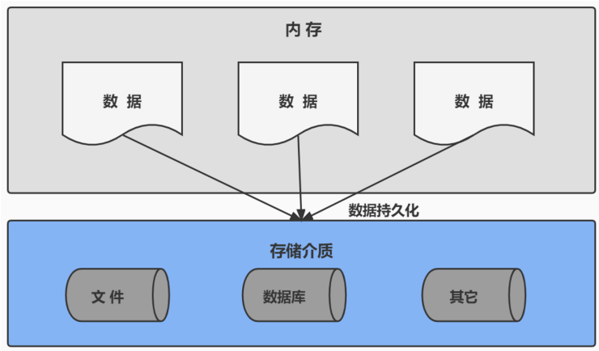

------

## 2. 数据库与数据库管理系统

------

### 2.1 数据库的相关概念

| DB：数据库（Database）                                       |
| ------------------------------------------------------------ |
| 即存储数据的“仓库”，其本质是一个文件系统。它保存了一系列有组织的数据。 |
| **DBMS：数据库管理系统（Database Management System）**       |
| 是一种操纵和管理数据库的大型软件，用于建立、使用和维护数据库，对数据库进行统一管理和 控制。用户通过数据库管理系统访问数据库中表内的数据。 |
| **SQL：结构化查询语言（Structured Query Language）**         |
| 专门用来与数据库通信的语言。                                 |

### 2.2 数据库与数据库管理系统的关系

数据库管理系统（DBMS）可以管理多个数据库，一般开发人员会针对每一个应用创建一个数据库。为保存应用中实体的数据，一般会在数据库创建多个表，以保存程序中实体用户的数据。

数据库管理系统、数据库和表的关系如图所示：

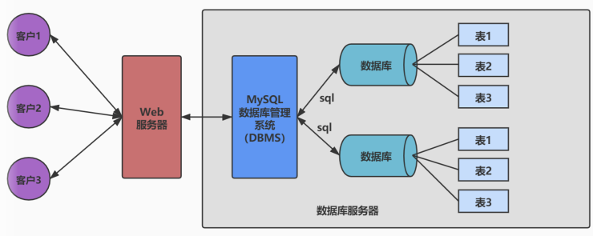

### 2.3 常见的数据库管理系统排名（DBMS）

目前互联网上常见的数据库管理软件有 Oracle、MySQL、MS SQL Server、DB2、PostgreSQL、Access、SyBase、Informix这几种。以下是2021年*DB-Engines Ranking对各数据库受欢迎程度进行调查后的统计结果：（查看数据库最新排名：[https://db-engines.com/en/ranking）](https://db-engines.com/en/ranking%EF%BC%89)

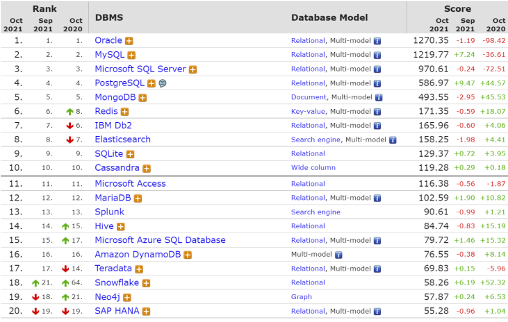

### 2.4 常见的数据库介绍

**Oracle**

1979年，Oracle 2诞生，它是第一个商用的RDBMS（关系型数据库管理系统）。随着Oracle软件的名气越来越大，公司也改名叫Oracle公司。

2007年，总计85亿美金收购BEA System。

2009年，总计74亿美金收购SUN。此前的2008年，SUN以10亿美金收购MySQL。意味着Oracle同时拥有了MySQL的管理权，至此Oracle在数据库领域中成为绝对的领导者。

2013年，甲骨文超越IBM，成为继Microsoft后全球第二大软件公司。

如今Oracle的年收入达到了400亿美金，足以证明商用（收费）数据库软件的价值。

**SQL Server**

SQL Server是微软开发的大型商业数据库，诞生于1989年。C#、.net等语言常使用，与WinNT完全集成，也可以很好地与Microsoft BackOffice产品集成。

**DB2**

IBM公司的数据库产品，收费的。常应用在银行系统中。

**PostgreSQL**

PostgreSQL的稳定性极强，最符合SQL标准，开放源码，具备商业级DBMS质量。PG对数据量大的文本以及SQL处理较快。

**SyBase**

已经淡出历史舞台。提供了一个非常专业数据建模的工具PowerDesigner。

**SQLite**

嵌入式的小型数据库，应用在手机端。零配置，SQLite3不用安装，不用配置，不用启动、关闭或者配置数据库实例。当系统崩溃后不用做任何恢复操作，再下次使用数据库的时候自恢复。

**Informix**

IBM公司出品，取自Information和Unix的结合，它是第一个被移植到Linux上的商业数据库产品。仅运行与Unix/Linux平台，命令行操作。性能较高，支持集群 ，适应与安全性要求极高的系统，尤其是银行，证券系统的应用。

## 3. MySQL介绍


### 3.1 概述

- MySQL是一个`开放源码的关系型数据库管理系统`，由瑞典 MySQL AB（创始人Michael Widenius）公司1995年开发，迅速成为开源数据库的No.1。
- 2008年被`Sun`收购（10亿美金），2009年Sun被`Oracle`收购。`MariaDB`应运而生。（MySQL的创造者担心MySQL有闭源的风险，因此创建了MySQL的分支项目MariaDB）
- MySQL6.x版本之后分为`社区版`和`商业版`。
- MySQL是一种关联数据库管理系统，将数据保存在不同的表中，而不是将所有数据放在一个大仓库内，这样就增加了速度并提高了灵活性。
- MySQL是开源的，所以你不需要支付额外的费用。
- MySQL是可以定制的，采用了`GPL（GUN General Public License）`协议，你可以需改源码来开发自己的MySQL系统。
- MySQL支持大型的数据库。可以处理拥有上千万条记录的大型数据库。
- MySQL支持大型数据库，支持5000万条记录的数据仓库 ，32位系统表文件最大可支持`4GB`，64位系统支持最大的表文件为`8TB`。
- MySQL使用`标准的SQL数据语言`形式。
- MySQL可以允许运行于多个系统上，并且支持多种语言。这些编程语言包括C、C++、Python、Java、Perl、PHP、和Ruby等。

### 3.2 MySQL发展史重大事件

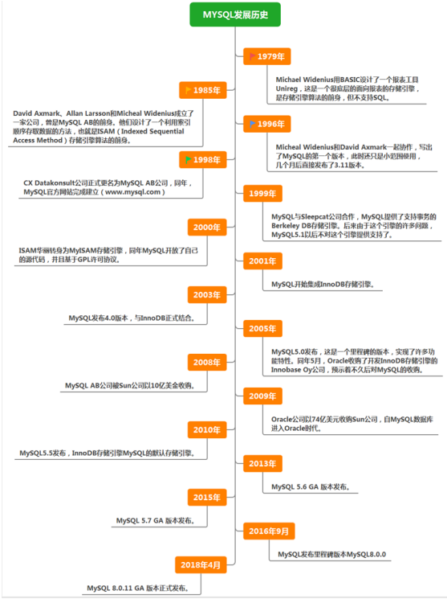

------

## 4.RDBMS与非RDBMS

------

从排名中我们能看出来，关系型数据库绝对是DBMS的主流，其中使用最多的DBMS分贝是Oracle、MySQL和SQL Server。这些都是关系型数据库（RDBMS）。

### 4.1 关系型数据库（RDBMS）

#### 4.1.1 实质

- 这种类型的数据库是`最古老`的数据库类型，关系型数据库模型是把复杂的数据结构归结为简单的`二元关系`（即二维表格形式）。

  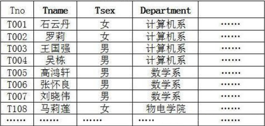

- 关系型数据库以`行（row）`和`列（column）`的形式存储数据，以便于用户理解。这一系列的行和列被称为`表（table）`，一组表组成了一个`库（database）`。

- 表与表之间的数据记录有关系（relationship）。现实世界中的各种实体以及实体之间的各种联系均用`关系模型`来表示。关系型数据库就是建立在`关系模型`基础上的数据库。

- SQL就是关系型数据库的查询语言。
  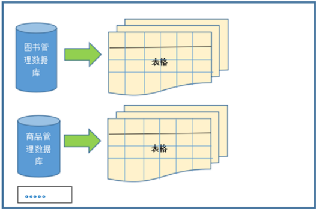

#### 4.1.2 优势

- **复杂查询**可以用SQL语句方便的在一个表以及多个表之间做非常复杂的数据查询。
- **事务支持**使得对于安全性能很高的数据访问要求得以实现。

### 4.2 非关系型数据库（非RDBMS）

#### 4.2.1 介绍

**非关系型数据库**，可看成传统关系型数据库的功能`阉割版本`，基于键值对存储数据，不需要经过SQL层的解析，`性能非常高`。同时通过减少不常用的功能，进一步提高性能。

目前基本上大部分主流的非关系型数据库都是免费的。

#### 4.2.2 有哪些非关系型数据库

相比于SQL，NoSQL泛指非关系型数据库，包括了榜单上的键值型数据库、文档型数据库、搜索引擎和列存储等，除此以外还包括图形数据库。也只有用NoSQL一词才能将这些技术囊括进来。

**键值型数据库**

键值型数据库通过Key-Value键值的方式来存储数据，其中Key和Value可以是简单的对象，也可以是复杂的对象，Key作为唯一的标识符，优点是查找速度快，在这方面明显优于关系型数据库，缺点是无法像关系型数据库一样使用条件过滤（比如WHERE），如果你不知道去哪里找数据，就要遍历所有的键，这就会消耗大量的计算。

键值型数据库典型的使用场景是作为`内存缓存`。`Redis`是最流行的键值型数据库。

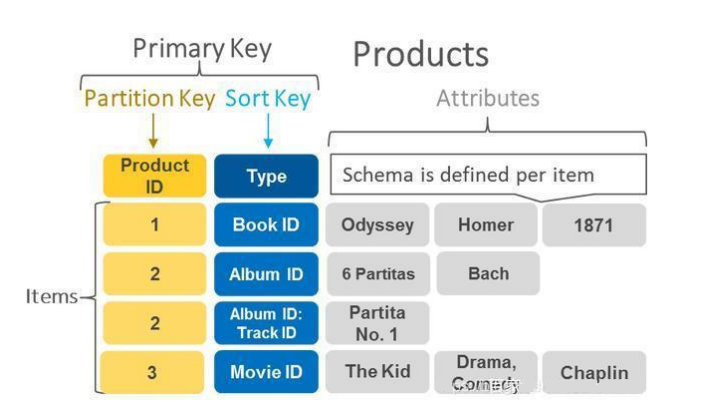

**文档型数据库**

此类型数据库可存放并获取文档，可以是XML、JSON等格式。在数据库中文档作为处理信息的基本单位，一个文档就相当于一条记录。文档数据库所存放的文档，就相当于键值数据库所存放的“值”。MongoDB是最流行的文档型数据库。此外，还有CouchDB等。

**搜索引擎数据库**

虽然关系型数据库采用了索引提升检索效率，但是针对全文索引效率却较低。搜索引擎数据库是应用在搜索引擎领域的数据存储形式，由于搜索引擎会爬取大量的数据，并以特定的格式进行存储，这样在检索的时候才能保证性能最优。核心原理是“倒排索引”。

典型产品：Solr、Elasticsearch、Splunk等。

**列式数据库**

列式数据库是相对于行式存储的数据库，Oracle、MySQL、SQL Server等数据库都是采用的行式存储（Row-based），而列式数据库是将数据按照列存储到数据库中，这样做的好处是可以大量降低系统的I/O，适合于分布式文件系统，不足在于功能相对有限。典型产品：HBase等。


**图形数据库**

图形数据库，利用了图这种数据结构存储了实体（对象）之间的关系。图形数据库最典型的例子就是社交网络中人与人的关系，数据模型主要是以节点和边（关系）来实现，特点在于能高效的解决复杂的关系问题。典型产品：Neo4J、InfoGrid等。


### 4.3 小结

NoSQL的分类很多，即便如此，在DBMS排名中，还是SQL阵营的比重更大，影响力前五的DBMS中有4个是关系型数据库，而排名前二十的DBMS中也有12个是关系型数据库。所以说，掌握SQL是非常有必要的。

------

## 5. 关系型数据库设计规则

------

- 关系型数据库的典型数据结构就是`数据表`，这些数据表的组成都是结构化的（Structured）。
- 将数据放到表中，再放到库中。
- 一个数据库中可以有多个表，每个表都有一个名字，用来标识自己。表名具有唯一性。
- 表具有一些特性，这些特性定义了数据在表中如何存储，类似Java和Python中“类”的设计。

### 5.1 表、记录、字段

- E-R（entity-relationship，实体-联系）模型中有三个主要概念是：`实体集`、`属性`、`联系集`。
- 一个实体集（class）对应于数据库中的一个表（table），一个实体（instance）则对应于数据库表中的一行（row），也称为一条记录（record）。一个属性（attribute）对应于数据库表中的一列（column），也成为一个字段（field）。

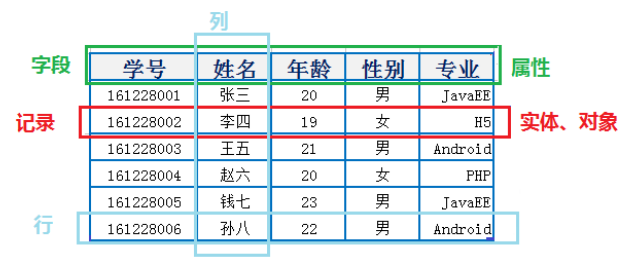

```
ORM思想（Object Relational Mapping）体现：
	数据库中的一个表  <--->  Java或Python中的一个类
	表中的一条数据    <--->  类中的一个对象（或实体）
	表中的一个列      <--->  类中的一个字段、属性（field)
```

### 5.2 表的关联关系

- 表与表之间的数据记录有关系（relationship）。现实世界中的各种实体以及实体之间的各种联系均用关系模型来表示。
- 四种：一对一关联、一对多关联、多对多关联、自我引用

#### 5.2.1 一对一关系（one-to-one）

- 在实际的开发中应用不多，因为一对一可以创建成一张表。

- 举例：设计

  ```
  学生表
  ```

  ：学号、姓名、手机号码、班级、系别、身份证号码、家庭住址、籍贯、紧急联系人……

  - 拆分为两个表：两个表的记录是一一对应关系
  - `基础信息表`（常用信息）：学号、姓名、手机号码、班级、系别
  - `档案信息表`（不常用信息）：学号、身份证号码、家庭住址、籍贯、紧急联系人……

- 两种建表原则：

  - 外键唯一：主表的主键和从表的外键（唯一），形成主外键关系，外键唯一。
  - 外键是主键：主表的主键和从表的主键，形成主外键关系。

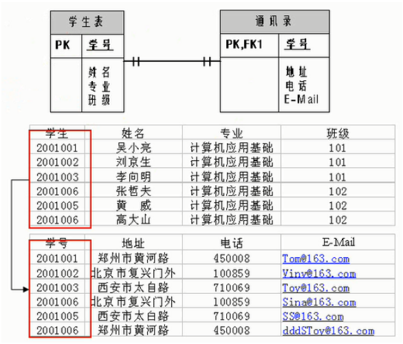

#### 5.2.2 一对多关系（one-to-many）

- 常见实例场景：`客户表和订单表`，`分类表和商品表`，`部门表和员工表`。
- 举例：
  - 员工表：编号、姓名、……、所属部门
  - 部门表：编号、名称、简介
- 一对多建表原则：在从表（多方）创建一个字段，字段作为外键指向主表（一方）的主键
  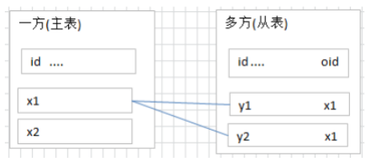

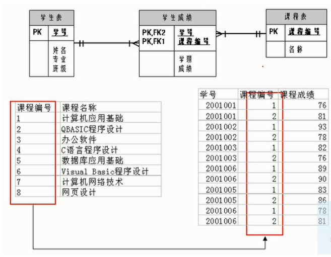

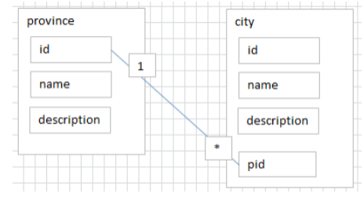

#### 5.2.3 多对多关系（many-to-many）

要表示多对多关系必须创建第三个表，该表通常称为`联接表`，它将多对多关系划分为两个一对多关系。将这两个表的主键都插入到第三个表中。

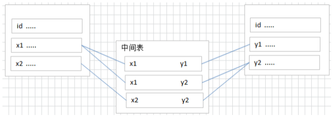

- **举例1：学生-课程**

  - `学生信息表`：一行代表一个学生的信息（学号、姓名、手机号码、班级、系别 ……）
  - `课程信息表`：一行代表一个课程的信息（课程编号、授课老师、简介 ……）
  - `选课信息表`：一个学生可以选多门课，一门课可以被多个学生选择

  ```
  学号      课程编号
  1         1001
  2         1001
  1         1002
  ```

- **举例2：产品-订单**
  “订单 ”表和“产品”表有一种多对多的关系，这种关系是通过与“订单明细”表建立两个一对多关系来定义的。一个订单可以有多个产品，每个产品可以出现在多个订单中。

  - `产品表`：产品表中的每条记录表示一个产品。
  - `订单表`：订单表中的每条记录表示一个订单。
  - `订单明细表`：每个产品可以与订单表中的多条记录对应，即出现在多个订单中。一个订单可以与产品表中的多条记录对应，即包含多个产品。

  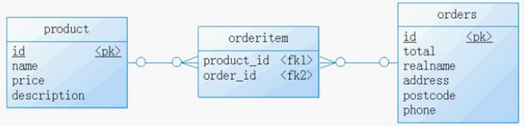

#### 5.3.4 自我引用（Self reference）

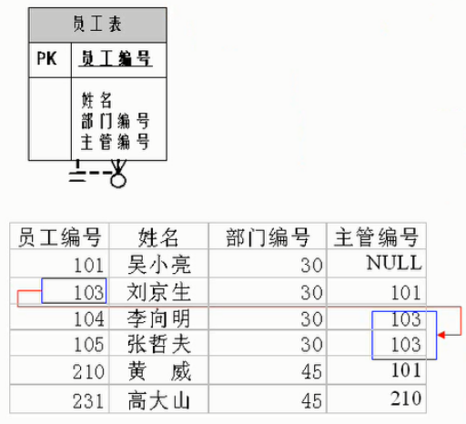

- 在实际的开发中应用不多，因为一对一可以创建成一张表。
- 举例：设计`学生表`：学号、姓名、手机号码、班级、系别、身份证号码、家庭住址、籍贯、紧急联系人、……