# 第02章_MySQL环境搭建

 2022-04-07   2022-04-18   [技术博客](https://new-wangz.github.io/categories/%E6%8A%80%E6%9C%AF%E5%8D%9A%E5%AE%A2/)   424   [0](https://new-wangz.github.io/2022/04/07/%E7%AC%AC02%E7%AB%A0-MySQL%E7%8E%AF%E5%A2%83%E6%90%AD%E5%BB%BA/#valine-comments)

## 1. MySQL的卸载

------

### 步骤 1 ：停止MySQL服务

在卸载之前，先停止MySQL8.0的服务。按键盘上的“Ctrl + Alt + Delete”组合键，打开“任务管理器”对话框，可以在“服务”列表找到“MySQL8.0”的服务，如果现在“正在运行”状态，可以右键单击服务，选择“停止”选项停止MySQL8.0的服务，如图所示。

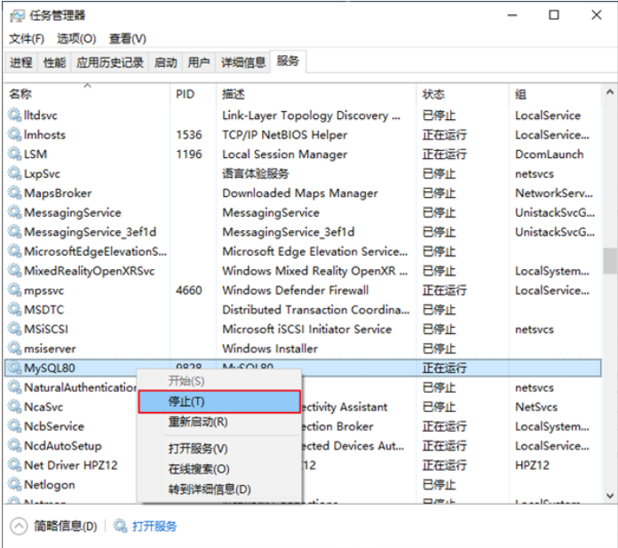

### 步骤 2 ：软件的卸载

**方式 1 ：通过控制面板方式**

卸载MySQL8.0的程序可以和其他桌面应用程序一样直接在“控制面板”选择“卸载程序”，并在程序列表中找到MySQL8.0服务器程序，直接双击卸载即可，如图所示。这种方式删除，数据目录下的数据不会跟着删除。

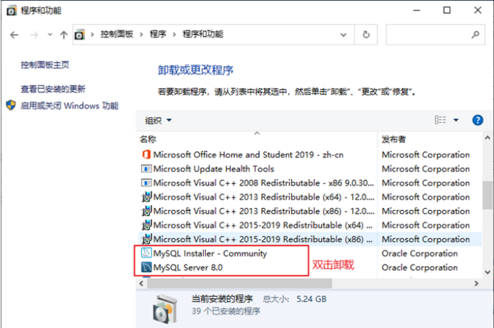

**方式 2 ：通过 360 或电脑管家等软件卸载**

**方式 3 ：通过安装包提供的卸载功能卸载**

你也可以通过安装向导程序进行MySQL8.0服务器程序的卸载。

① 再次双击下载的mysql-installer-community-8.0.26.0.msi文件，打开安装向导。安装向导会自动检测已安装的MySQL服务器程序。

② 选择要卸载的MySQL服务器程序，单击“Remove”（移除），即可进行卸载。

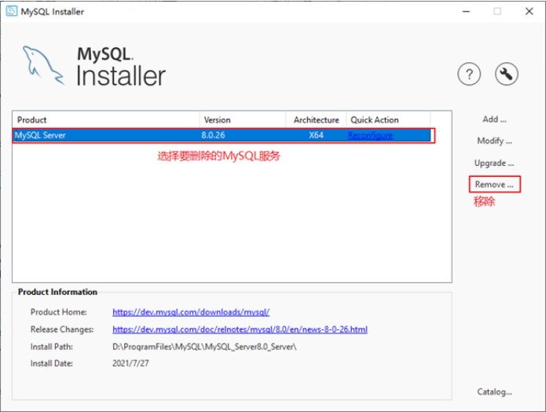

③ 单击“Next”（下一步）按钮，确认卸载。

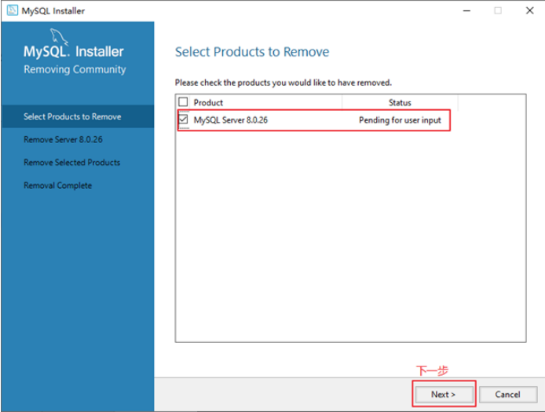

④ 弹出是否同时移除数据目录选择窗口。如果想要同时删除MySQL服务器中的数据，则勾选“Remove the data directory”，如图所示。

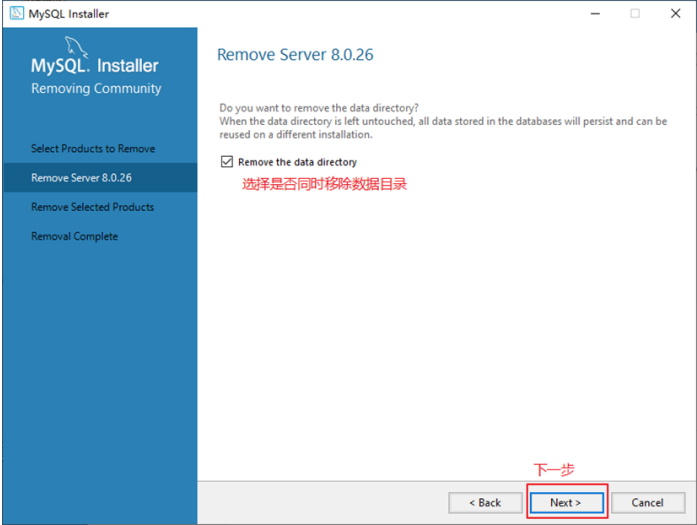

⑤ 执行卸载。单击“Execute”（执行）按钮进行卸载。

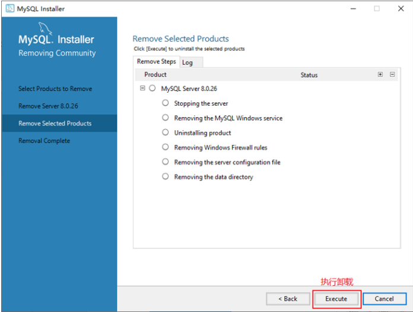

⑥ 完成卸载。单击“Finish”（完成）按钮即可。如果想要同时卸载MySQL8.0的安装向导程序，勾选“Yes，Uninstall MySQL Installer”即可，如图所示。

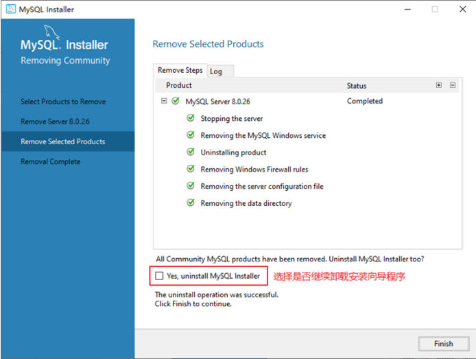

### 步骤 3 ：残余文件的清理

如果再次安装不成功，可以卸载后对残余文件进行清理后再安装。

- 服务目录：mysql服务的安装目录
- 数据目录：默认在C:\ProgramData\MySQL

如果自己单独指定过数据目录，就找到自己的数据目录进行删除即可。

**注意：请在卸载前做好数据备份**
在操作完以后，需要重启计算机，然后进行安装即可。**如果仍然安装失败，需要继续操作如下步骤 4**

### 步骤 4 ：清理注册表（选做）

如果前几步做了，再次安装还是失败，那么可以清理注册表。

如何打开注册表编辑器：在系统的搜索框中输入`regedit`

```
HKEY_LOCAL_MACHINE\SYSTEM\ControlSet001\Services\Eventlog\Application\MySQL服务 目录删除
HKEY_LOCAL_MACHINE\SYSTEM\ControlSet001\Services\MySQL服务 目录删除
HKEY_LOCAL_MACHINE\SYSTEM\ControlSet002\Services\Eventlog\Application\MySQL服务 目录删除
HKEY_LOCAL_MACHINE\SYSTEM\ControlSet002\Services\MySQL服务 目录删除
HKEY_LOCAL_MACHINE\SYSTEM\CurrentControlSet\Services\Eventlog\Application\MySQL服务 目录删除
HKEY_LOCAL_MACHINE\SYSTEM\CurrentControlSet\Services\MySQL服务删除
注册表中的ControlSet001,ControlSet002,不一定是 001 和002,可能是ControlSet005、 006之类
```

### 步骤 5 ：删除环境变量配置

找到path环境变量，将其中关于mysql的环境变量删除， **切记不要全部删除。**

例如：删除 D:\develop_tools\mysql\MySQLServer8.0.26\bin 这个部分

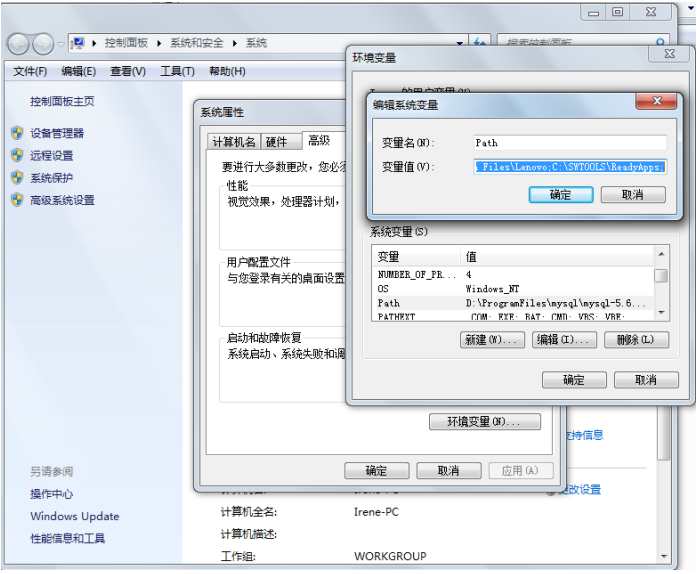

------

## 2. MySQL的下载、安装、配置

------

### 2. 1 MySQL的 4 大版本

- **MySQL Community Server 社区版本** ，开源免费，自由下载，但不提供官方技术支持，适用于大多数普通用户。
- **MySQL Enterprise Edition 企业版本** ，需付费，不能在线下载，可以试用 30 天。提供了更多的功能和更完备的技术支持，更适合于对数据库的功能和可靠性要求较高的企业客户。
- **MySQL Cluster 集群版** ，开源免费。用于架设集群服务器，可将几个MySQL Server封装成一个Server。需要在社区版或企业版的基础上使用。
- **MySQL Cluster CGE 高级集群版** ，需付费。

目前最新版本为`8.0.27`，发布时间 `2021 年 10 月`。此前，8.0.0 在 2016.9.12日就发布了。

此外，官方还提供了`MySQL Workbench`（GUITOOL）一款专为MySQL设计的`图形界面管理工具`。MySQLWorkbench又分为两个版本，分别是`社区版`（MySQL Workbench OSS）、`商用版`（MySQLWorkbenchSE）。

### 2. 2 软件的下载

**1. 下载地址**

官网： [https://www.mysql.com](https://www.mysql.com/)

**2. 打开官网，点击DOWNLOADS**

然后，点击`MySQL Community(GPL) Downloads`

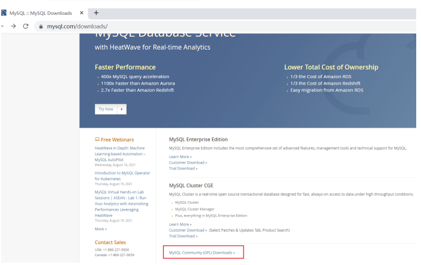

**3. 点击 MySQL Community Server**

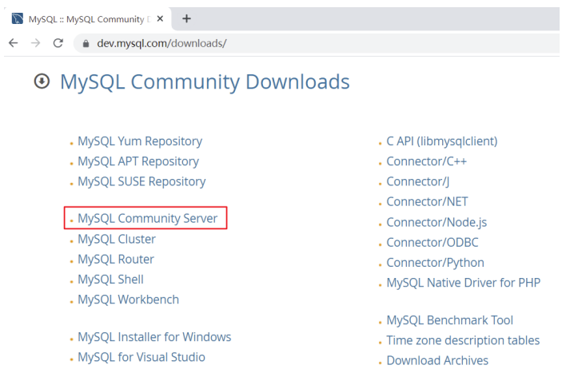

**4. 在General Availability(GA) Releases中选择适合的版本**

Windows平台下提供两种安装文件：MySQL二进制分发版（.msi安装文件）和免安装版（.zip压缩文件）。一般来讲，应当使用二进制分发版，因为该版本提供了图形化的安装向导过程，比其他的分发版使用起来要简单，不再需要其他工具启动就可以运行MySQL。

- 这里在Windows 系统下推荐下载`MSI安装程序`；点击`Go to Download Page`进行下载即可

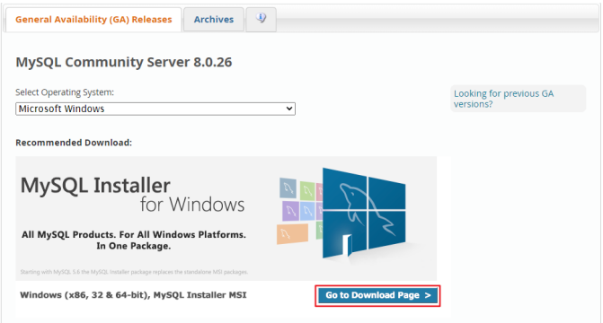

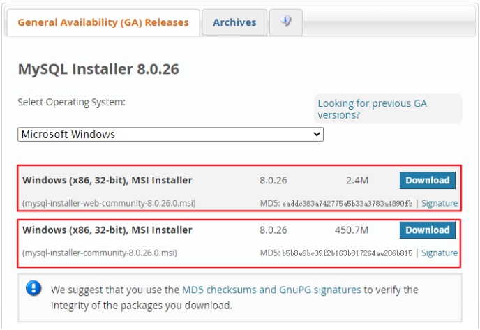

- Windows下的MySQL 8. 0 安装有两种安装程序

  - `mysql-installer-web-community-8.0.26.0.msi` 下载程序大小： 2. 4 M；安装时需要联网安装组件。
  - `mysql-installer-community-8.0.26.0.msi` 下载程序大小： 450. 7 M；安装时离线安装即
    可。 **推荐**。

- 如果安装MySQL 5. 7 版本的话，选择`Archives`，接着选择MySQL 5. 7 的相应版本即可。这里下载最近期的MySQL 5. 7. 34 版本。

  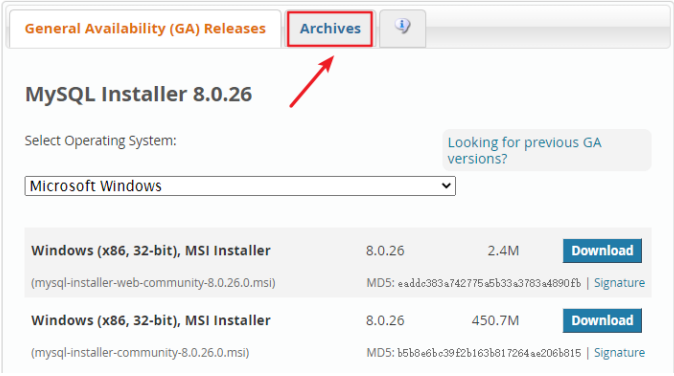

  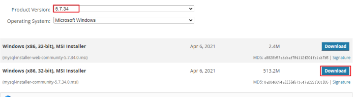

### 2. 3 MySQL 8. 0 版本的安装

MySQL下载完成后，找到下载文件，双击进行安装，具体操作步骤如下。

#### 步骤 1

双击下载的mysql-installer-community-8.0.26.0.msi文件，打开安装向导。

#### 步骤 2

打开“Choosing a Setup Type”（选择安装类型）窗口，在其中列出了 5 种安装类型，分别是Developer Default（默认安装类型）、Server only（仅作为服务器）、Client only（仅作为客户端）、Full（完全安装）、Custom（自定义安装）。这里选择“Custom（自定义安装）”类型按钮，单击“Next(下一步)”按钮。

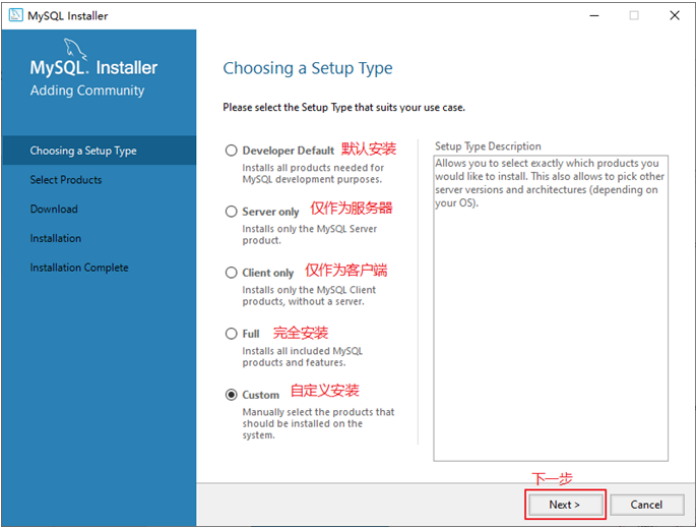

#### 步骤 3

打开“Select Products” （选择产品）窗口，可以定制需要安装的产品清单。例如，选择“MySQL Server 8.0.26-X64”后，单击“→”添加按钮，即可选择安装MySQL服务器，如图所示。采用通用的方法，可以添加其他你需要安装的产品。

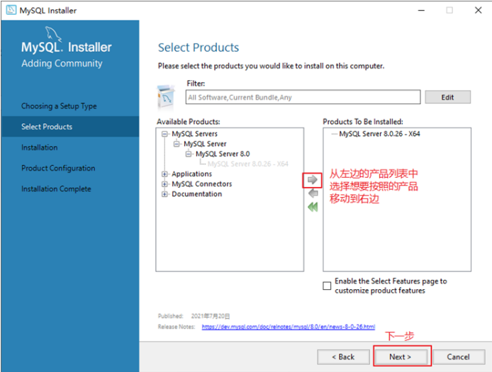

此时如果直接“Next”（下一步），则产品的安装路径是默认的。如果想要自定义安装目录，则可以选中对应的产品，然后在下面会出现“Advanced Options”（高级选项）的超链接。

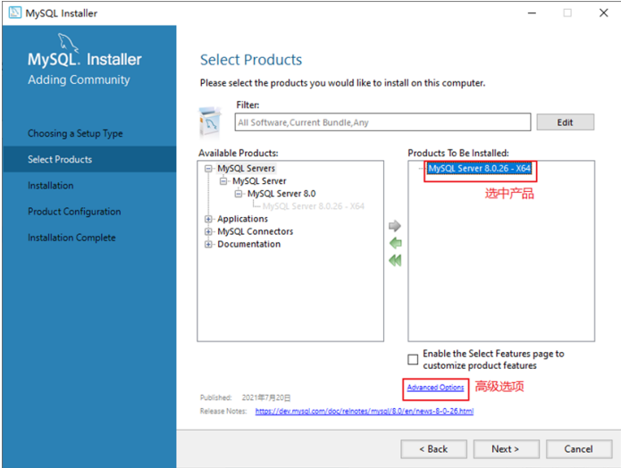

单击“Advanced Options”（高级选项）则会弹出安装目录的选择窗口，如图所示，此时你可以分别设置MySQL的服务程序安装目录和数据存储目录。如果不设置，默认分别在C盘的Program Files目录和ProgramData目录（这是一个隐藏目录）。如果自定义安装目录，请避免“中文”目录。另外，建议服务目录和数据目录分开存放。

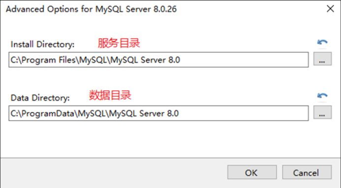

#### 步骤 4

在上一步选择好要安装的产品之后，单击“Next”（下一步）进入确认窗口，如图所示。单击
“Execute”（执行）按钮开始安装。

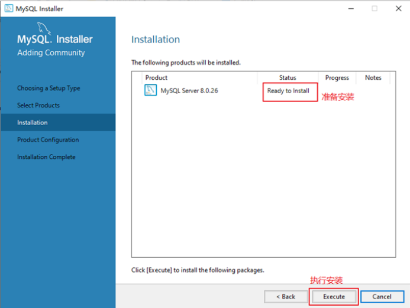

#### 步骤 5

安装完成后在“Status”（状态）列表下将显示“Complete”（安装完成），如图所示。

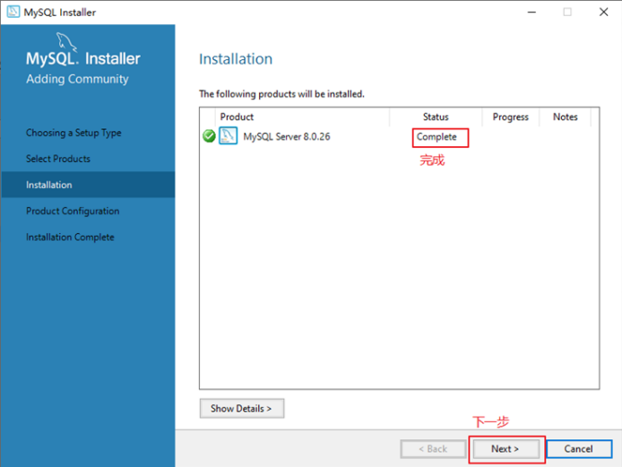

### 2. 4 配置MySQL 8. 0

MySQL安装之后，需要对服务器进行配置。具体的配置步骤如下。

#### 步骤 1

在上一个小节的最后一步，单击“Next”（下一步）按钮，就可以进入产品配置窗口。

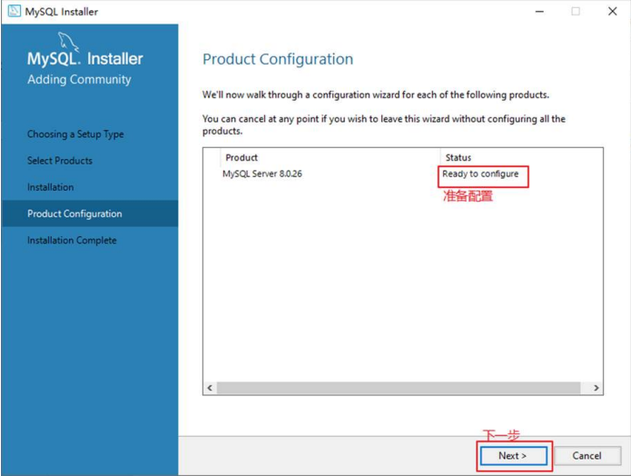

#### 步骤 2

单击“Next”（下一步）按钮，进入MySQL服务器类型配置窗口，如图所示。端口号一般选择默认
端口号 3306 。

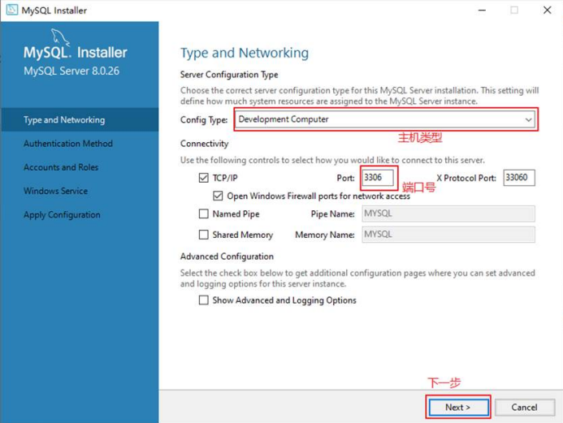

其中，“Config Type”选项用于设置服务器的类型。单击该选项右侧的下三角按钮，即可查看 3 个选项，如图所示。

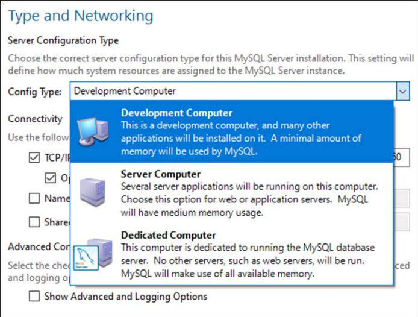

- `Development Machine（开发机器）`：该选项代表典型个人用桌面工作站。此时机器上需要运行多个应用程序，那么MySQL服务器将占用最少的系统资源。
- `Server Machine（服务器）`：该选项代表服务器，MySQL服务器可以同其他服务器应用程序一起运行，例如Web服务器等。MySQL服务器配置成适当比例的系统资源。
- `Dedicated Machine（专用服务器）`：该选项代表只运行MySQL服务的服务器。MySQL服务器配置成使用所有可用系统资源。

#### 步骤 3

单击“Next”（下一步）按钮，打开设置授权方式窗口。其中，上面的选项是MySQL8.0提供的新的授权方式，采用SHA256基础的密码加密方法；下面的选项是传统授权方法（保留5.x版本兼容性）。

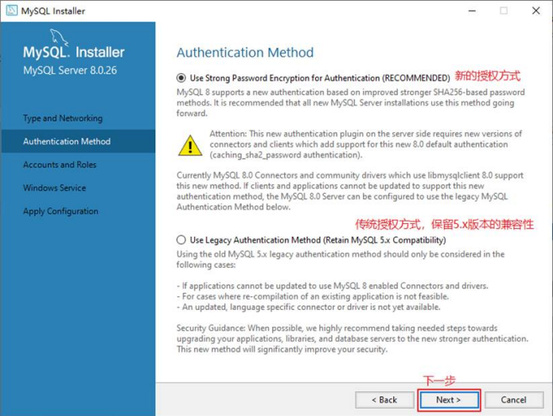

#### 步骤 4

单击“Next”（下一步）按钮，打开设置服务器root超级管理员的密码窗口，如图所示，需要输入两次同样的登录密码。也可以通过“Add User”添加其他用户，添加其他用户时，需要指定用户名、允许该用户名在哪台/哪些主机上登录，还可以指定用户角色等。此处暂不添加用户，用户管理在MySQL高级特性篇中讲解。

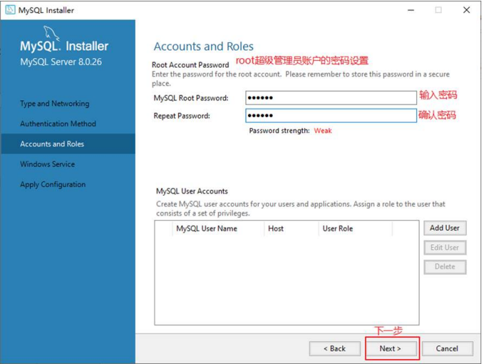

#### 步骤 5

单击“Next”（下一步）按钮，打开设置服务器名称窗口，如图所示。该服务名会出现在Windows服务列表中，也可以在命令行窗口中使用该服务名进行启动和停止服务。本书将服务名设置为“MySQL80”。如果希望开机自启动服务，也可以勾选“Start the MySQL Server at System Startup”选项（推荐）。

下面是选择以什么方式运行服务？可以选择“Standard System Account”(标准系统用户)或者“Custom User”(自定义用户)中的一个。这里推荐前者。

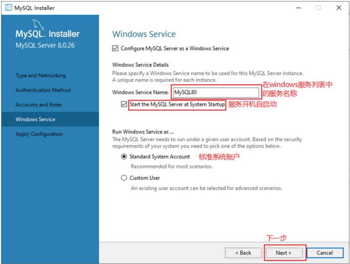

#### 步骤 6

单击“Next”（下一步）按钮，打开确认设置服务器窗口，单击“Execute”（执行）按钮。

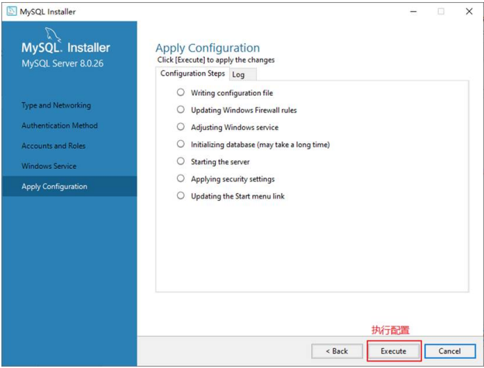

#### 步骤 7

完成配置，如图所示。单击“Finish”（完成）按钮，即可完成服务器的配置。


#### 步骤 8

如果还有其他产品需要配置，可以选择其他产品，然后继续配置。如果没有，直接选择“Next”（下一步），直接完成整个安装和配置过程。

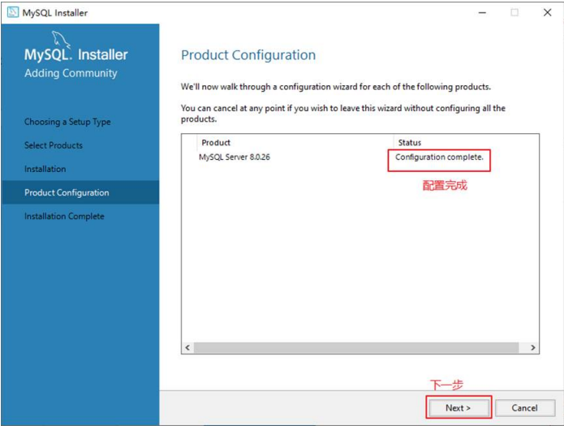

#### 步骤 9

结束安装和配置。

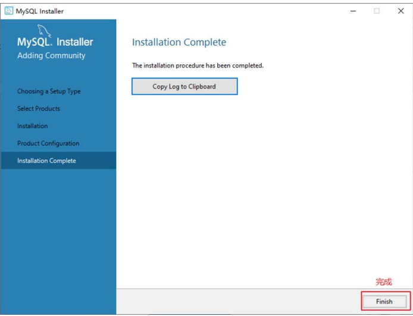

### 2. 5 配置MySQL 8. 0 环境变量

如果不配置MySQL环境变量，就不能在命令行直接输入MySQL登录命令。下面说如何配置MySQL的环境变量：

- 步骤 1 ：在桌面上右击【此电脑】图标，在弹出的快捷菜单中选择【属性】菜单命令。
- 步骤 2 ：打开【系统】窗口，单击【高级系统设置】链接。
- 步骤 3 ：打开【系统属性】对话框，选择【高级】选项卡，然后单击【环境变量】按钮。
- 步骤 4 ：打开【环境变量】对话框，在系统变量列表中选择path变量。
- 步骤5 ：单击【编辑】按钮，在【编辑环境变量】对话框中，将MySQL应用程序的bin目录（C:\ProgramFiles\MySQL\MySQL Server 8.0\bin）添加到变量值中，用分号将其与其他路径分隔开。
- 步骤 6 ：添加完成之后，单击【确定】按钮，这样就完成了配置path变量的操作，然后就可以直接输入MySQL命令来登录数据库了。

------

## 3. MySQL的登录

------

### 3. 1 服务的启动与停止

MySQL安装完毕之后，需要启动服务器进程，不然客户端无法连接数据库。

在前面的配置过程中，已经将MySQL安装为Windows服务，并且勾选当Windows启动、停止时，MySQL也自动启动、停止。

#### 方式 1 ：使用图形界面工具

- 步骤 1 ：打开windows服务

  - 方式 1 ：计算机（点击鼠标右键）→ 管理（点击）→ 服务和应用程序（点击）→ 服务（点击）
  - 方式 2 ：控制面板（点击）→ 系统和安全（点击）→ 管理工具（点击）→ 服务（点击）
  - 方式 3 ：任务栏（点击鼠标右键）→ 启动任务管理器（点击）→ 服务（点击）
  - 方式 4 ：单击【开始】菜单，在搜索框中输入“services.msc”，按Enter键确认

- 步骤 2 ：找到MySQL80（点击鼠标右键）→ 启动或停止（点击）

  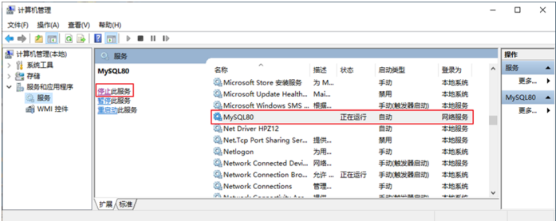

#### 方式 2 ：使用命令行工具

```
# 启动　MySQL　服务命令
net　start　MySQL服务名

# 停止　MySQL　服务命令
net　stop　MySQL服务名
```

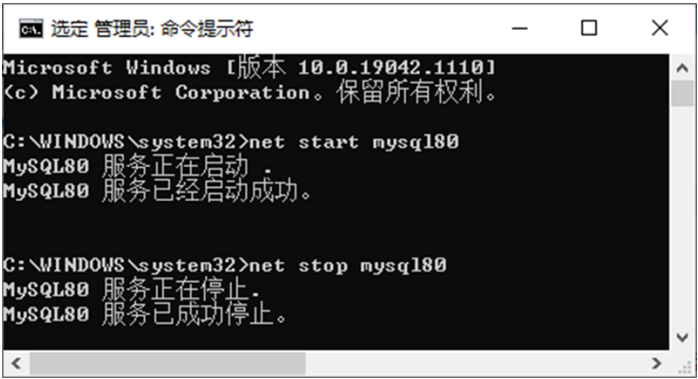

##### 说明：

- start和stop后面的服务名应与之前配置时指定的服务名一致。
- 如果当你输入命令后，提示“拒绝服务”，请以`系统管理员身份`打开命令提示符界面重新尝试。

### 3. 2 自带客户端的登录与退出

当MySQL服务启动完成后，便可以通过客户端来登录MySQL数据库。注意：确认服务是开启的。

#### 登录方式 1 ：MySQL自带客户端

开始菜单 → 所有程序 → MySQL → MySQL 8.0 Command Line Client


- 说明：仅限于root用户

#### 登录方式 2 ：windows命令行

- 格式：

  ```
  mysql -h 主机名 -P 端口号 -u 用户名 -p密码
  ```

- 举例：

  ```
  mysql -h localhost -P 3306 -u root -pabc123  # 这里我设置的root用户的密码是abc123
  ```

  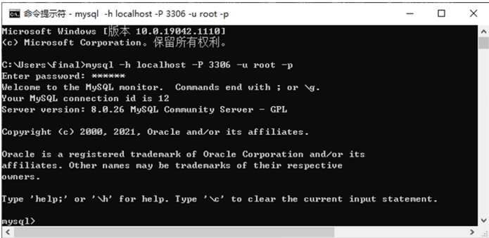

- 注意：
  1．-p与密码之间不能有空格，其他参数名与参数值之间可以有空格也可以没有空格。如：

  ```
  mysql -hlocalhost -P3306 -uroot -pabc123
  ```

  ２．密码建议在下一行输入，保证安全

  ```
  mysql -h localhost -P 3306 -u root -p
  Enter password:****
  ```

  3．客户端和服务器在同一台机器上，所以输入localhost或者IP地址127.0.0.1。同时，因为是连接本机： -hlocalhost就可以省略，如果端口号没有修改：-P3306也可以省略

  简写成：

  ```
  mysql -u root -p
  Enter password:****
  ```

  连接成功后，有关于MySQL Server服务版本的信息，还有第几次连接的id标识。

  也可以在命令行通过以下方式获取MySQL Server服务版本的信息：

  ```
  c:\> mysql -V
  ```

  ```
  c:\> mysql --version
  ```

  或**登录**后，通过以下方式查看当前版本信息：

  ```
  mysql> select version();
  ```

#### 退出登录

```
exit
或
quit
```

------

## 4. MySQL演示使用

------

### 4. 1 MySQL的使用演示

#### 1 .查看所有的数据库

```
show databases;
```

- “information_schema”是 MySQL 系统自带的数据库，主要保存 MySQL 数据库服务器的系统信息，比如数据库的名称、数据表的名称、字段名称、存取权限、数据文件 所在的文件夹和系统使用的文件夹，等等。
- “performance_schema”是 MySQL 系统自带的数据库，可以用来监控 MySQL 的各类性能指标。
- “sys”数据库是 MySQL 系统自带的数据库，主要作用是以一种更容易被理解的方式展示 MySQL 数据库服务器的各类性能指标，帮助系统管理员和开发人员监控 MySQL 的技术性能。
- “mysql”数据库保存了 MySQL 数据库服务器运行时需要的系统信息，比如数据文件夹、当前使用的字符集、约束检查信息，等等。

为什么 Workbench 里面我们只能看到“demo”和“sys”这 2 个数据库呢？

这是因为，Workbench 是图形化的管理工具，主要面向开发人 员，“demo”和“sys”这 2 个数据库已经够用了。如果有特殊需求，比如，需要监控 MySQL 数据库各项性能指标、直接操作 MySQL 数据库系统文件等，可以由 DBA 通过 SQL 语句，查看其它的系统数据库。

#### 2 、创建自己的数据库

```
create database 数据库名;

#创建atguigudb数据库，该名称不能与已经存在的数据库重名。
create database atguigudb;
```

#### 3 、使用自己的数据库

```
use 数据库名;

#使用atguigudb数据库
use atguigudb;
```

说明：如果没有使用use语句，后面针对数据库的操作也没有加“数据名”的限定，那么会报“ERROR 1046(3D000): No database selected”（没有选择数据库）

使用完use语句之后，如果接下来的SQL都是针对一个数据库操作的，那就不用重复use了，如果要针对另一个数据库操作，那么要重新use。

#### 4 、查看某个库的所有表格

```
show tables;  #要求前面有use语句

show tables from 数据库名;
```

#### 5 、创建新的表格

```
create table 表名称(
字段名 数据类型,
字段名 数据类型
);
```

说明：如果是最后一个字段，后面就用加逗号，因为逗号的作用是分割每个字段。

```
#创建学生表
create table student(
id int,
name varchar( 20 )  #说名字最长不超过 20 个字符
);
```

#### 6 、查看一个表的数据

```
select * from 数据库表名称;

#查看学生表的数据
select * from student;
```

#### 7 、添加一条记录

```
insert into 表名称 values(值列表);

#添加两条记录到student表中
insert into student values( 1 ,'张三');
insert into student values( 2 ,'李四');
```

报错：

```
mysql> insert into student values( 1 ,'张三');
ERROR 1366 (HY000): Incorrect string value: '\xD5\xC5\xC8\xFD' for column 'name' at　row 1
mysql> insert into student values( 2 ,'李四');
ERROR 1366 (HY000): Incorrect string value: '\xC0\xEE\xCB\xC4' for column 'name' at　row 1
mysql> show create table student;
```

字符集的问题。

#### 8 、查看表的创建信息

```
show create table 表名称\G

#查看student表的详细创建信息
show create table student\G
#结果如下
*************************** 1. row ***************************
Table: student
Create Table: CREATE TABLE `student` (
`id` int( 11 ) DEFAULT NULL,
`name` varchar( 20 ) DEFAULT NULL
) ENGINE=InnoDB DEFAULT CHARSET=latin1
1 row in set (0.00 sec)
```

上面的结果显示student的表格的默认字符集是“latin1”不支持中文。

#### 9 、查看数据库的创建信息

```
show create database 数据库名\G

#查看atguigudb数据库的详细创建信息
show create database atguigudb\G
```

上面的结果显示atguigudb数据库也不支持中文，字符集默认是latin1。

#### 10 、删除表格

```
drop table 表名称;

#删除学生表
drop table student;
```

#### 11 、删除数据库

```
drop database 数据库名;

#删除atguigudb数据库
drop database atguigudb;
```

### 4. 2 MySQL的编码设置

**MySQL 8. 0 中**

在MySQL 8.0版本之前，默认字符集为latin1，utf8字符集指向的是utf8mb3。网站开发人员在数据库设计的时候往往会将编码修改为utf8字符集。如果遗忘修改默认的编码，就会出现乱码的问题。从MySQL 8.0开始，数据库的默认编码改为`utf8mb4`，从而避免了上述的乱码问题。

------

## 5. MySQL图形化管理工具

------

MySQL图形化管理工具极大地方便了数据库的操作与管理，常用的图形化管理工具有：MySQL
Workbench、phpMyAdmin、Navicat Preminum、MySQLDumper、SQLyog、dbeaver、MySQL ODBCConnector。

### Navicat

Navicat MySQL是一个强大的MySQL数据库服务器管理和开发工具。它可以与任何3.21或以上版本的MySQL一起工作，支持触发器、存储过程、函数、事件、视图、管理用户等，对新手来说易学易用。其精心设计的图形用户界面可以让用户用一种安全简便的方式来快速方便地创建、组织、访问和共享信息。Navicat支持中文，有免费版本提供。下载地址：**<http://www.navicat.com/>** 。

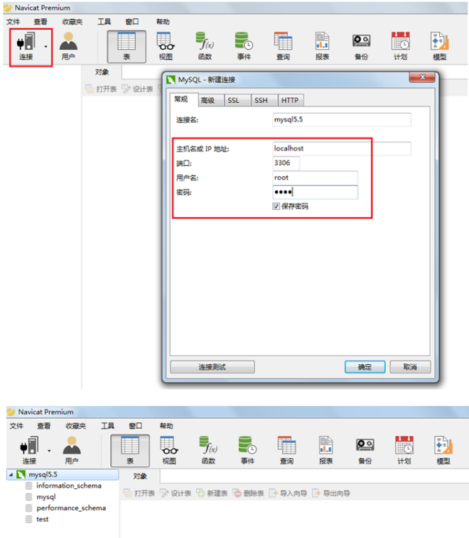

### 可能出现连接问题

有些图形界面工具，特别是旧版本的图形界面工具，在连接MySQL8时出现“Authentication plugin ‘caching_sha2_password’ cannot be loaded”错误。

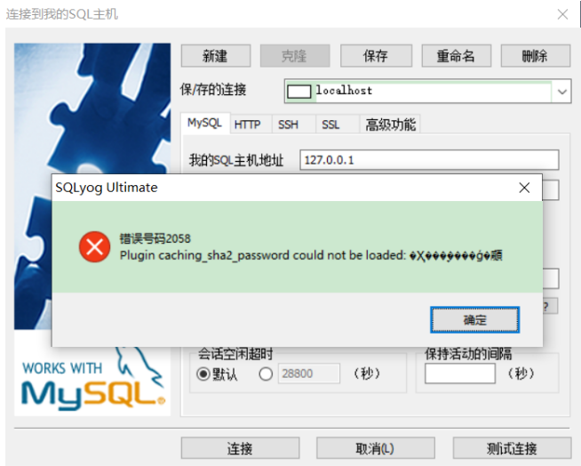

出现这个原因是MySQL8之前的版本中加密规则是mysql_native_password，而在MySQL8之后，加密规则是caching_sha2_password。解决问题方法有两种，第一种是升级图形界面工具版本，第二种是把MySQL8用户登录密码加密规则还原成mysql_native_password。

第二种解决方案如下，用命令行登录MySQL数据库之后，执行如下命令修改用户密码加密规则并更新用户密码，这里修改用户名为“root@localhost”的用户密码规则为“mysql_native_password”，密码值为“123456”，如图所示。

```
#使用mysql数据库
USE mysql;

#修改'root'@'localhost'用户的密码规则和密码
ALTER USER 'root'@'localhost' IDENTIFIED WITH mysql_native_password BY 'abc123';

#刷新权限
FLUSH PRIVILEGES;
```

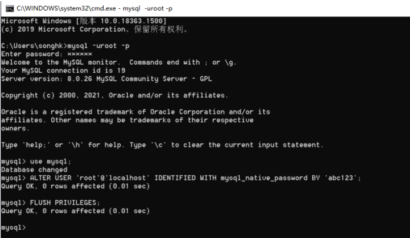

------

## 6. MySQL目录结构与源码

------

### 6. 1 主要目录结构

| MySQL的目录结构                             | 说明                                 |
| ------------------------------------------- | ------------------------------------ |
| bin目录                                     | 所有MySQL的可执行文件。如：mysql.exe |
| MySQLInstanceConfig.exe                     | 数据库的配置向导，在安装时出现的内容 |
| data目录                                    | 系统数据库所在的目录                 |
| my.ini文件                                  | MySQL的主要配置文件                  |
| c:\ProgramData\MySQL\MySQL Server 8.0\data\ | 用户创建的数据库所在的目录           |

### 6. 2 MySQL 源代码获取

首先，你要进入 MySQL下载界面。 这里你不要选择用默认的“Microsoft Windows”，而是要通过下拉栏，找到“Source Code”，在下面的操作系统版本里面， 选择 Windows（Architecture Independent），然后点击下载。

接下来，把下载下来的压缩文件解压，我们就得到了 MySQL 的源代码。

MySQL 是用 C++ 开发而成的，我简单介绍一下源代码的组成。

mysql-8.0.22 目录下的各个子目录，包含了 MySQL 各部分组件的源代码：

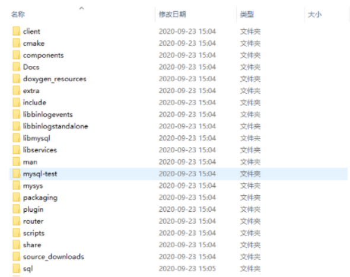

- sql 子目录是 MySQL 核心代码；
- libmysql 子目录是客户端程序 API；
- mysql-test 子目录是测试工具；
- mysys 子目录是操作系统相关函数和辅助函数；

源代码可以用记事本打开查看，如果你有 C++ 的开发环境，也可以在开发环境中打开查看。

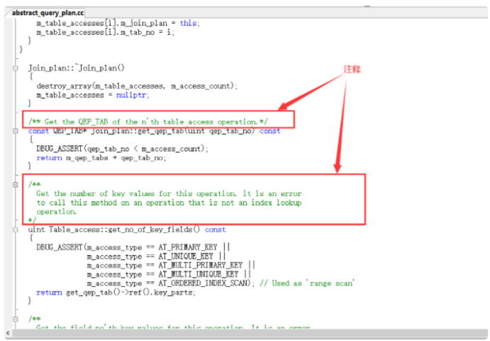

如上图所示，源代码并不神秘，就是普通的 C++ 代码，跟你熟悉的一样，而且有很多注释，可以帮助你理解。阅读源代码就像在跟 MySQL 的开发人员对话一样，十分有趣。

------

## 7. 常见问题的解决(课外内容)

------

### 问题 1 ：root用户密码忘记，重置的操作

1. 通过任务管理器或者服务管理，关掉mysqld(服务进程)
2. 通过命令行+特殊参数开启mysqld mysqld – defaults-file=”D:\ProgramFiles\mysql\MySQLServer5.7Data\my.ini” –skip-grant-tables
3. 此时，mysqld服务进程已经打开。并且不需要权限检查
4. mysql -uroot 无密码登陆服务器。另启动一个客户端进行
5. 修改权限表 （ 1 ） use mysql; （ 2 ）update user set authentication_string=password(‘新密码’) where user=’root’ and Host=’localhost’; （ 3 ）flush privileges;
6. 通过任务管理器，关掉mysqld服务进程。
7. 再次通过服务管理，打开mysql服务。
8. 即可用修改后的新密码登陆。

### 问题 2 ：mysql命令报“不是内部或外部命令”

如果输入mysql命令报“不是内部或外部命令”，把mysql安装目录的bin目录配置到环境变量path中。如下：

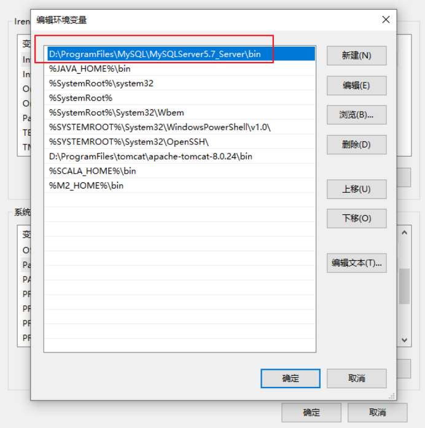

### 问题 3 ：错误ERROR ：没有选择数据库就操作表格和数据

| ERROR 1046 (3D000): No database selected                     |
| ------------------------------------------------------------ |
| 解决方案一：就是使用“USE 数据库名;”语句，这样接下来的语句就默认针对这个数据库进行操作 |
| 解决方案二：就是所有的表对象前面都加上“数据库.”              |

### 问题 4 ：命令行客户端的字符集问题

```
mysql> INSERT INTO t_stu VALUES( 1 ,'张三','男');
ERROR 1366 (HY000): Incorrect string value: '\xD5\xC5\xC8\xFD' for column 'sname' at row 1
```

原因：服务器端认为你的客户端的字符集是utf- 8 ，而实际上你的客户端的字符集是GBK。

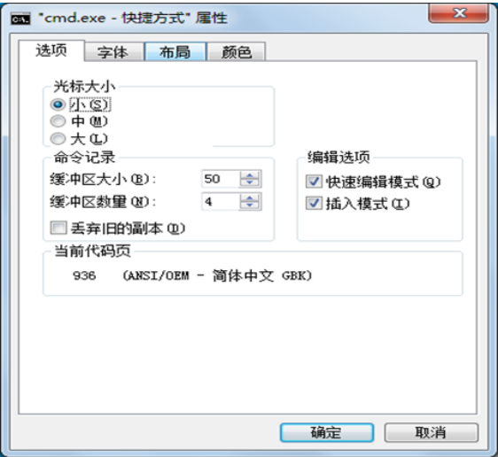

查看所有字符集： **SHOW VARIABLES LIKE ‘character_set_%’;**


解决方案，设置当前连接的客户端字符集 **“SET NAMES GBK;”**

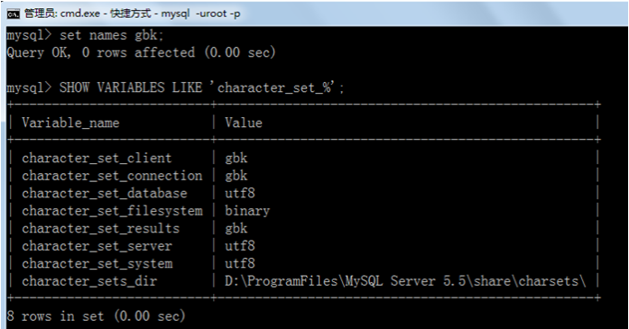

### 问题 5 ：修改数据库和表的字符编码

修改编码：

1. 先停止服务
2. 修改my.ini文件
3. 重新启动服务

说明：

如果是在修改my.ini之前建的库和表，那么库和表的编码还是原来的Latin1，要么删了重建，要么使用alter语句修改编码。

```
mysql> create database 0728 db charset Latin1;
Query OK, 1 row affected (0.00 sec)
mysql> use 0728db;
Database changed

mysql> create table student (id int , name varchar( 20 )) charset Latin1;
Query OK, 0 rows affected (0.02 sec)

mysql> show create table student\G
*************************** 1. row ***************************
Table: student
Create Table: CREATE TABLE `student` (
`id` int( 11 ) NOT NULL,
`name` varchar( 20 ) DEFAULT NULL,
PRIMARY KEY (`id`)
) ENGINE=InnoDB DEFAULT CHARSET=latin1
1 row in set (0.00 sec)

mysql> alter table student charset utf8; #修改表字符编码为UTF8
Query OK, 0 rows affected (0.01 sec)
Records: 0 Duplicates: 0 Warnings: 0

mysql> show create table student\G
*************************** 1. row ***************************
Table: student
Create Table: CREATE TABLE `student` (
`id` int( 11 ) NOT NULL,
`name` varchar( 20 ) CHARACTER SET latin1 DEFAULT NULL,  #字段仍然是latin1编码
PRIMARY KEY (`id`)
) ENGINE=InnoDB DEFAULT CHARSET=utf8
1 row in set (0.00 sec)

mysql> alter table student modify name varchar( 20 ) charset utf8; #修改字段字符编码为UTF8
Query OK, 0 rows affected (0.05 sec)
Records: 0 Duplicates: 0 Warnings: 0

mysql> show create table student\G
*************************** 1. row ***************************
Table: student
Create Table: CREATE TABLE `student` (
`id` int( 11 ) NOT NULL,
`name` varchar( 20 ) DEFAULT NULL,
PRIMARY KEY (`id`)
) ENGINE=InnoDB DEFAULT CHARSET=utf8
1 row in set (0.00 sec)

mysql> show create database 0728 db;;
+--------+-----------------------------------------------------------------+
|Database| Create Database 	|
+------+-------------------------------------------------------------------+
| 0728 db| CREATE DATABASE `0728db` /*!40100 DEFAULT CHARACTER SET latin1 */|
+------+-------------------------------------------------------------------+
1 row in set (0.00 sec)

mysql> alter database 0728 db charset utf8; #修改数据库的字符编码为utf8
Query OK, 1 row affected (0.00 sec)

mysql> show create database 0728 db;
+--------+-----------------------------------------------------------------+
|Database| Create Database 	|
+--------+-----------------------------------------------------------------+
| 0728 db | CREATE DATABASE `0728db` /*!40100 DEFAULT CHARACTER SET utf8 */|
+--------+-----------------------------------------------------------------+
1 row in set (0.00 sec)
```