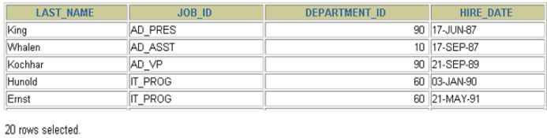
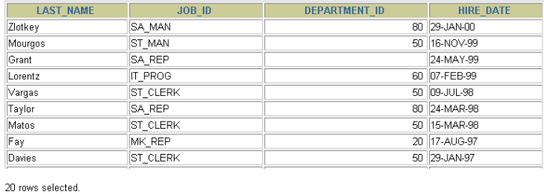
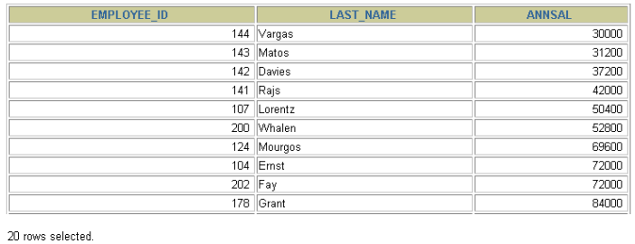
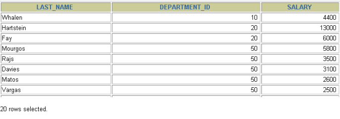

# 第05章_排序与分页

 2022-04-10   2022-04-18   [技术博客](https://new-wangz.github.io/categories/%E6%8A%80%E6%9C%AF%E5%8D%9A%E5%AE%A2/)   229   [0](https://new-wangz.github.io/2022/04/10/%E7%AC%AC05%E7%AB%A0-%E6%8E%92%E5%BA%8F%E4%B8%8E%E5%88%86%E9%A1%B5/#valine-comments)

## 1. 排序数据

------

### 1. 1 排序规则

- 使用 ORDER BY 子句排序
  - **ASC（ascend）: 升序**
  - **DESC（descend）:降序**
- **ORDER BY 子句在SELECT语句的结尾。**

### 1. 2 单列排序

```
SELECT last_name, job_id, department_id, hire_date
FROM employees
ORDER BY hire_date ;
```



```
SELECT last_name, job_id, department_id, hire_date
FROM employees
ORDER BY hire_date DESC ;
```



```
SELECT employee_id, last_name, salary* 12 annsal
FROM employees
ORDER BY annsal;
```



### 1. 3 多列排序

```
SELECT last_name, department_id, salary
FROM employees
ORDER BY department_id, salary DESC;
```



- 可以使用不在SELECT列表中的列排序。
- 在对多列进行排序的时候，首先排序的第一列必须有相同的列值，才会对第二列进行排序。如果第一列数据中所有值都是唯一的，将不再对第二列进行排序。

------

## 2. 分页

------

### 2. 1 背景

背景 1 ：查询返回的记录太多了，查看起来很不方便，怎么样能够实现分页查询呢？

背景 2 ：表里有 4 条数据，我们只想要显示第 2 、 3 条数据怎么办呢？

### 2. 2 实现规则

- 分页原理
  所谓分页显示，就是将数据库中的结果集，一段一段显示出来需要的条件。

- MySQL中使用 LIMIT 实现分页

- 格式：

  ```
  LIMIT [位置偏移量,] 行数
  ```

  第一个“位置偏移量”参数指示MySQL从哪一行开始显示，是一个可选参数，如果不指定“位置偏移量”，将会从表中的第一条记录开始（第一条记录的位置偏移量是 0 ，第二条记录的位置偏移量是1 ，以此类推）；第二个参数“行数”指示返回的记录条数。

- 举例

  ```
  --前 10 条记录：
  SELECT * FROM 表名 LIMIT 0 , 10 ;
  或者
  SELECT * FROM 表名 LIMIT 10 ;
  
  --第 11 至 20 条记录：
  SELECT * FROM 表名 LIMIT 10 , 10 ;
  
  --第 21 至 30 条记录：
  SELECT * FROM 表名 LIMIT 20 , 10 ;
  ```

  > MySQL 8.0中可以使用“LIMIT 3 OFFSET 4”，意思是获取从第 5 条记录开始后面的 3 条记录，和“LIMIT 4,3;”返回的结果相同。

- 分页显式公式 ：（**当前页数- 1 ）\*每页条数，每页条数**

  ```
  SELECT * FROM table
  LIMIT(PageNo - 1 )*PageSize,PageSize;
  ```

- **注意：LIMIT 子句必须放在整个SELECT语句的最后！**

- 使用 LIMIT 的好处
  约束返回结果的数量可以减少数据表的网络传输量，也可以提升查询效率。如果我们知道返回结果只有1 条，就可以使用LIMIT 1，告诉 SELECT 语句只需要返回一条记录即可。这样的好处就是 SELECT 不需要扫描完整的表，只需要检索到一条符合条件的记录即可返回。

### 2. 3 拓展

在不同的 DBMS 中使用的关键字可能不同。在 MySQL、PostgreSQL、MariaDB 和 SQLite 中使用 LIMIT 关键字，而且需要放到 SELECT 语句的最后面。

- 如果是 SQL Server 和 Access，需要使用 TOP 关键字，比如：

  ```
  SELECT TOP 5 name, hp_max FROM heros ORDER BY hp_max DESC
  ```

- 如果是 DB2，使用FETCH FIRST 5 ROWS ONLY这样的关键字：

  ```
  SELECT name, hp_max FROM heros ORDER BY hp_max DESC FETCH FIRST 5 ROWS ONLY
  ```

- 如果是 Oracle，你需要基于 ROWNUM 来统计行数：

  ```
  SELECT rownum,last_name,salary FROM employees WHERE rownum < 5 ORDER BY salary DESC;
  ```

  需要说明的是，这条语句是先取出来前 5 条数据行，然后再按照 hp_max 从高到低的顺序进行排序。但这样产生的结果和上述方法的并不一样。我会在后面讲到子查询，你可以使用

  ```
  SELECT rownum, last_name,salary
  FROM (
  SELECT last_name,salary
  FROM employees
  ORDER BY salary DESC)
  WHERE rownum < 10 ;
  ```

  得到与上述方法一致的结果。